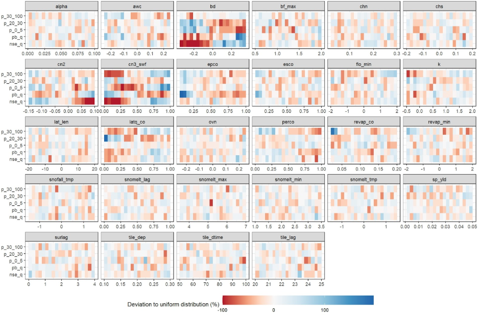
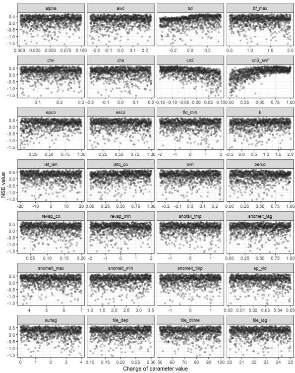
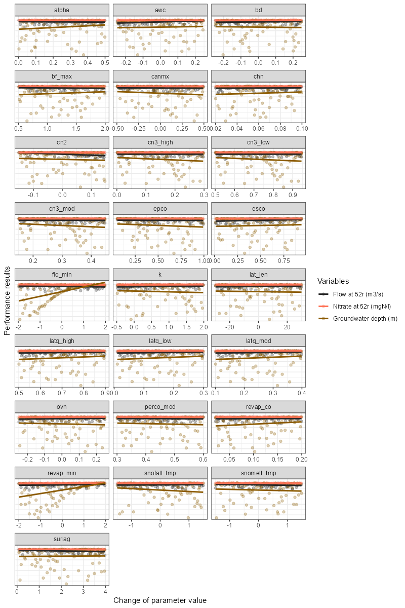
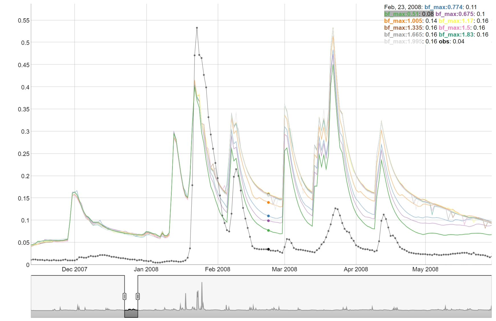
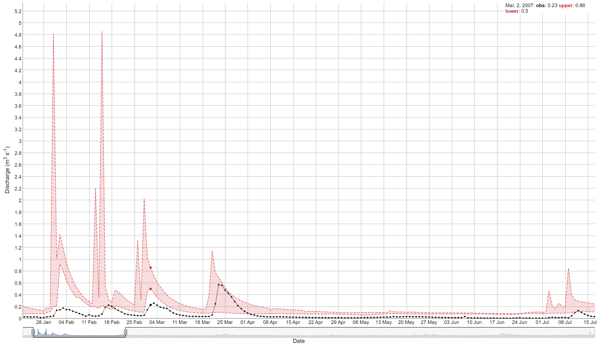
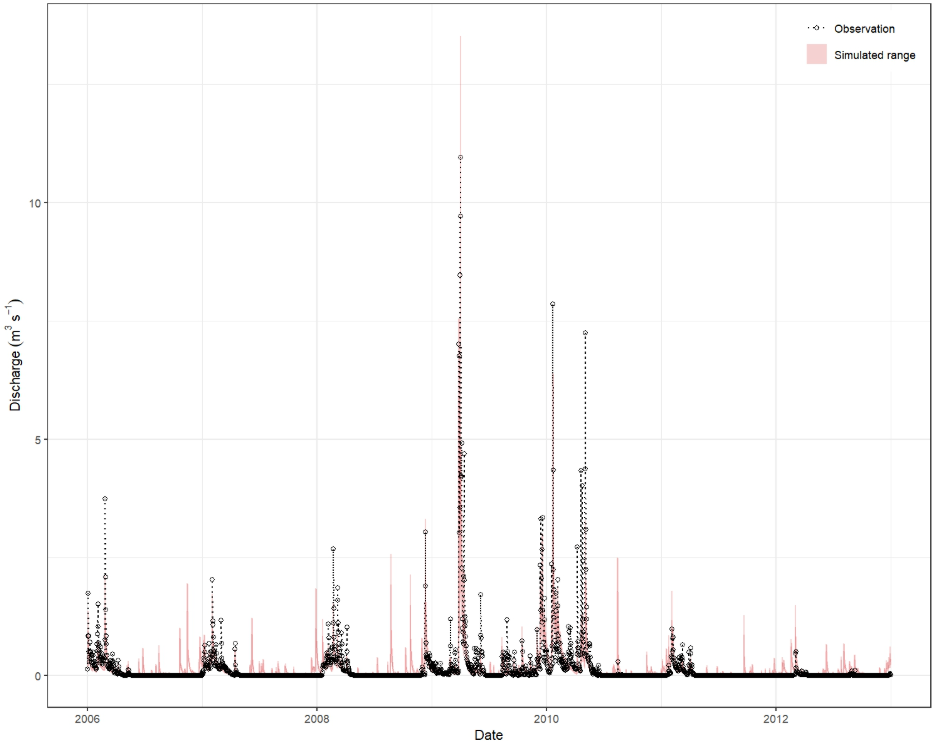

This page corresponds to **04_analyze_results.R** script in the hard calibration workflow. It analyzes the simulation results obtained from the SWAT runs and compares them to observed data. The analysis includes calculating goodness-of-fit values, plotting evaluation results, and ranking the results based on the defined criteria.

# 5. Process simulation results

Before loading the simulation results, you need to define the paths to the simulation (if not done yet) and observation data, as well as the time periods for analysis. The following code snippet shows how to set up these parameters.

```{r hc5, message = FALSE, warning = FALSE, eval = FALSE}
# Parameter definition ----------------------------------------------------
# Paths to simulation and observation data
# E.g. load the simulations with the last time stamp, if default
# save_file names in simulation runs is used.
sims <- list.files('./simulation/', pattern = '[0-9]{12}')
sim_path <- paste0('./simulation/', sims[length(sims)])

# E.g. path to discharge observations
flow_path <- './observation/q.csv'
# E.g. path to in-stream nitrate observations
ntot_path <- './observation/ntot.csv'

# Define time period to analyze (E.g. calibration or validation period)
# Periods for different variables can be different, but calibration and
# validation should not be mixed.
# Discharge
period_q <- c('2006-01-01', '2012-12-31')
# Water quality
period_wq <- c('2006-01-01', '2012-12-31')
```

Then the `load_swat_run` function from the **SWATrunR** package is used to load the most recent simulation results from the defined `simulation` folder.

```{r hc51, message = FALSE, warning = FALSE, eval = FALSE}
# Load and prepare simulation results -------------------------------------
sim <- load_swat_run(sim_path)
# Check for failed runs
failed_runs(sim)
```
The third step involves preprocessing the simulation data to filter for relevant dates, prepare concentration values, and calculate flow duration curves (FDCs) if needed. The `filter_period()` function is used to restrict the simulation results to the defined periods, while the `calc_fdc()` function calculates the flow duration curves for the simulated discharges.

```{r hc52, message = FALSE, warning = FALSE, eval = FALSE}
# Extract parameter set
par_vals <- sim$parameter$values

# Extract relevant output variables
# E.g. discharge
flow_sim <- filter_period(sim$simulation$flo_day, period_q)
# E.g. N load components
no3_sim  <- filter_period(sim$simulation$no3_day, period_wq)
nh3_sim  <- filter_period(sim$simulation$nh3_day, period_wq)
no2_sim  <- filter_period(sim$simulation$no2_day, period_wq)
orgn_sim <- filter_period(sim$simulation$orgn_day, period_wq)

# E.g. if FDC segments should be evaluated, calculate the
# FDC for the simulated discharges
flow_fdc_sim <- calc_fdc(flow_sim)

# Calculate total N from the four N fractions
ntot_sim <- sum_variables(no3_sim, nh3_sim, no2_sim, orgn_sim)

# Convert loads to concentrations
ntot_conc_sim <- load_to_conc(load = ntot_sim, flow = flow_sim,
                              load_unit = 'kg day-1', flow_unit = 'm3 s-1',
                              out_unit  = 'mg L-1')

```

# 6. Load and process observation data

Next, you need to load the observation data for discharge and, if required, water quality. The same filtering and preprocessing steps might be necessary. However, in the case of observed data, you may need to calculate loads from concentrations. If needed, the `conc_to_load()` function is available for this purpose.

```{r hc61, message = FALSE, warning = FALSE, eval = FALSE}
# Load and prepare observations ------------------------------------------
# E.g. discharge observations
flow_obs <- read_csv(flow_path) %>%
  filter_period(., period_q)
# E.g. Ntot concentration observations
ntot_conc_obs <- read_csv(ntot_path) %>%
  filter_period(., period_q)

# E.g. if FDC segments should be evaluated, calculate the
# FDC for the simulated discharges
flow_fdc_obs <- calc_fdc(flow_obs)

# E.g. if calibration should be done with loads and not concentrations
# convert observed concentrations to loads
ntot_obs <- conc_to_load(conc = ntot_conc_obs, flow = flow_obs,
                         conc_unit = 'mg L-1', flow_unit = 'm3 s-1',
                         out_unit  = 'kg day-1')
```

# 7. Calculate goodness-of-fit (GOF) values

After loading and preprocessing the simulation and observation data, you can calculate various goodness-of-fit (GOF) metrics to evaluate model performance. The `calc_gof()` function allows you to compute indices such as Nash–Sutcliffe Efficiency (NSE), Kling–Gupta Efficiency (KGE), percent bias (PBIAS), and many others available in the [hydroGOF](https://github.com/hzambran/hydroGOF) package for both discharge and water quality data.

```{r hc7, message = FALSE, warning = FALSE, eval = FALSE}
# Calculate goodness-of-fit values ----------------------------------------
# E.g. to calculate typical indices such as NSE, KGE, pbias, etc. for discharge
gof_flow <- calc_gof(sim = flow_sim, obs = flow_obs,
                     funs = list(nse_q = NSE, kge_q = KGE, pb_q = pbias,
                                 mae_q = mae))
```

Evaluating the Ratio of the Root Mean Square Error to the Standard Deviation of the Observed Data (RSR) for different flow conditions can improve hydrological model performance, as described in @pfannerstill2014. This can be done using the `calc_fdc_rsr()` function, which computes RSR values for different segments of the flow duration curve. The results can be combined with other GOF metrics using the provided code snippet.

```{r hc71, message = FALSE, warning = FALSE, eval = FALSE}
# Calculate RSR for different discharge FDC sections 
gof_fdc <- calc_fdc_rsr(fdc_sim = flow_fdc_sim, fdc_obs = flow_fdc_obs,
                        quantile_splits = c(5, 20, 70, 95))

# Calculate goodness-of-fit for Nitrogen
gof_ntot <- calc_gof(sim = ntot_sim, obs = ntot_obs,
                     funs = list(nse_n = NSE, kge_n = KGE, pb_n = pbias,
                                 mae_n = mae))

# E.g. if all calculated GOF tables should be joined to one table
gof_all <- list(gof_flow, gof_fdc, gof_ntot) %>%
  reduce(., left_join, by = 'run')
```

# 8. Plot evaluation results

There are sevelar ways **SWATtunR** helps to visualize the results of the goodness-of-fit calculations.

## Parameter identifiability

A useful approach for visually analyzing the goodness-of-fit is to create a parameter identifiability plot using `plot_parameter_identifiability()` function. This plot is prepared based on the methodology provided the article of @guse2020. The plot below shows the ranges of parameter, which perform better for a certain performance metric. The `run_fraction` defines the fraction of simulations which should be considered in the analysis (with 1000 runs this value should maybe not be lower than 0.2, too large values also do not make much sense). For 5000 runs 0.1 would be a good value.

This type of plot allows for the assessment of multiple performance criteria simultaneously. It is recommended to examine goodness-of-fit indices for different variables at the same time to identify potential trade-offs in parameter ranges. However, including too many indices in a single plot can make interpretation difficult. Therefore, it is advisable to select a subset of key indices for plotting.


```{r hc8, message = FALSE, warning = FALSE, eval = FALSE}
gof_sel <- select(gof_all, run, nse_q, pb_q, p_0_5, p_20_70, p_70_95, nse_n, pb_n)

# It is always good to get a general overview of the summary statistics of the
# calculated GOF indices.
summary(gof_sel)

plot_parameter_identifiability(parameters = par_vals,
                               objectives = gof_sel,
                               run_fraction = .2)

```

```{r hc81, echo=FALSE, out.width='95%', fig.align='center'}

```

## Dotty plots

Another common approach for analyzing the sensitivity of goodness-of-fit to parameter changes is the use of dotty plots by applying `plot_dotty()` function. These plots visualize how performance metrics vary with different parameter values. While a single dotty plot can provide insight, a comprehensive evaluation of multiple parameters often requires the assessment of several dotty plots to effectively guide updates to parameter ranges.

```{r hc82, message = FALSE, warning = FALSE, eval = FALSE}  
plot_dotty(par = par_vals, gof_all$nse_q,  y_label = "NSE value", n_col = 4)
```

```{r hc83, echo=FALSE, out.width='95%', fig.align='center'}

```

The `plot_dotty()` function is highly customizable, allowing assessment from different perspectives, and includes the following arguments:

- `par`: a data frame of model parameter values for each simulation.
- `var`: model performance result vector or list of vectors to be plotted against parameter values.
- `y_label`: the label or vector of labels for the y-axis. Default is `'y'`.
- `n_col`: number of columns in the facet grid. Default is `3`.
- `y_lim`: defines limits for the y-axis. Default is `NULL`.
- `y_inter`: Y-axis intercept value. Default is `NULL`.
- `trend`: logical, indicating whether to add a trend line. Default is `FALSE`.
- `run_ids`: a numeric vector of run IDs to be highlighted in the plot.
- `low_up`: logical, TRUE if the whole possible parameter range should be used for the x-axis. Default is `FALSE`.

Example below shows how to use the `plot_dotty()` function to visualize the performance with multiple variables and trends added.

```{r hc84, message = FALSE, warning = FALSE, eval = FALSE}  
# Example of usage:
plot_dotty(par = par_vals, 
           var = list(gof_all$$flo_day_52$nse,
                      gof_all$no3_day_52_conc$nse,
                      gof_all$gwd$nse), 
           y_label =  c('Flow at 52r (m3/s)', 
                        "Nitrate at 52r (mgN/l)", 
                        "Groundwater depth (m)"),
           trend = TRUE)
```

```{r plot_dotty_m, echo=FALSE, out.width='95%', fig.align = 'center'}

```

If model performance needs to be improved—for example, if the parameter identifiability plot clearly indicates that certain parameter ranges should be adjusted—it is recommended to return to [step 2](../articles/hc-par.html). At this stage, update the parameter boundaries, run simulations using the new parameter combinations, and then analyze the results again using this script.

## One-At-A-Time plot

To perform an OAT (One-At-A-Time) analysis could be used to visualize the sensitivity of the model to the parameters. The function `plot_oat()` allows you to plot the results of the OAT analysis. It requires a parameter set around which the OAT analysis should be performed, as well as the boundaries for the parameters. The sampling of OAT us done using `sample_oat()` function. `plot_oat()` function will then generate a plot showing how the model performance changes when varying one parameter at a time while keeping others fixed.

```{r oat, message = FALSE, warning = FALSE, eval = FALSE}
# Example of usage:
# If you want to perform an OAT analysis
# Select the parameter combination around which you want to do the OAT analysis
par_center_id <- 2

# Extract the center parameter set and assign again the "full" names to be used
# with SWATrunR
par_center <- sim$parameter$values[par_center_id, ] %>% 
  set_names(sim$parameter$definition$full_name)

# You can define your own parameter boundaries for the selected parameters
# Here a way how you can quickly extract the boundaries from the last simulation
par_bnd <- sim$parameter$values %>% 
  map(., ~ c(min(.x), max(.x))) %>% 
  map(., ~ round(.x, 3)) %>% 
  bind_cols(.) %>% 
  set_names(sim$parameter$definition$full_name)

# Sample the OAT parameter set and run the simulations
par_oat <- sample_oat(par = par_bnd, par_center = par_center)

par_oat <- filter(par_oat, parameter %in% c('center', 'bf_max.aqu | change = absval'))

sim_oat <- run_swatplus(project_path = model_path,
                        output = list(
                          flo_day = define_output(file = 'channel_sd_day',
                                                  variable = 'flo_out',
                                                  unit = cha_ids)),
                        parameter = par_oat[,3:ncol(par_oat)],
                        n_thread = n_cores)
# save_file = 'sim_oat')

# To visualize the OAT runs e.g. for the parameter surlag:
plot_oat(sim = sim_oat, obs = obs, variable = 'flo_day')

```

```{r oat_plot,  echo=FALSE, out.width='95%', fig.align = 'center'}

```

# 9. Rank results and select parameter combinations

If the model performance is acceptable, there are two approaches for selecting suitable parameter sets. One common method is to define thresholds for goodness-of-fit indices; another is to rank the model runs based on performance. Below are two examples for identifying an ensemble of acceptable parameter combinations.

## Ranking based selection

Ranking can be performed using two different methods available in the function `rank_gof()`. The first method, specified as `type` = 'rank', uses absolute ranks based on the goodness-of-fit values. The second method, `type` = 'norm', uses normalized goodness-of-fit values, which accounts for differences in performance across the indices and provides a more balanced comparison.

```{r hc9, message = FALSE, warning = FALSE, eval = FALSE}  
# Careful here that ranking is always done from smallest to largest value. 
# Therefore the indices must be modified before.
gof_adj <- gof_sel %>%
  mutate(nse_q = - nse_q,
         pb_q = - abs(pb_q),
         nse_n = - nse_n,
         pb_n = - abs(pb_n))

gof_rank <- rank_gof(gof_adj, type = 'norm')
# Here just the first 10 runs of the ranked GOF indices are selected.
run_sel <- gof_rank$run[1:10]
run_ids <- run_to_id(run_sel)
```

## Threshold based selection

Another approach is to select parameter sets based on thresholds for goodness-of-fit indices. This method allows for the identification of parameter sets that meet specific performance criteria.

```{r hc91, message = FALSE, warning = FALSE, eval = FALSE}
# Here e.g. for NSE and pbias for discharge and N loads.
run_sel <- which(gof_sel$nse_q > 0.5 & gof_sel$nse_n > 0.7 &
                 abs(gof_sel$pb_q) < 5 & abs(gof_sel$pb_n) < 20)
run_ids <- run_to_id(run_sel)
```

# 10. View simulated time series

Visualizing the simulated time series is an essential step in evaluating the strengths and weaknesses of the model simulations. This helps identify how well the model captures key hydrological dynamics, such as peak flows, low flows, and seasonal trends. It also allows for the detection of systematic errors or biases in the simulations.

The **SWATtunR** package provides several interactive plotting functions that make it easy to explore and interpret the simulated data. These tools support a more detailed and intuitive assessment of model performance over time, especially when compared directly with observed data.

## Interactive plotting

The `view_timeseries()` function is a powerful tool for interactively visualizing simulated time series data. It allows users to zoom in and out and select specific time periods for detailed analysis.

```{r hc10, message = FALSE, warning = FALSE, eval = FALSE}
##Simple example
view_timeseries(flow_sim, flow_obs, run_ids = run_ids)
```
```{r hc101,  echo=FALSE, out.width='95%', fig.align = 'center'}

```

## Static plotting

The `plot_timeseries()` function provides a static plot of the simulated time series, which is useful for generating publication-quality figures or for quick visual assessments.

```{r hc102, message = FALSE, warning = FALSE, eval = FALSE}
plot_timeseries(flow_sim, flow_obs, run_ids = 1)
```
```{r hc103,  echo=FALSE, out.width='95%', fig.align = 'center'}

```

If the results are satisfactory, you can proceed to the next step of saving the parameters and writing the `calibration.cal` file. Otherwise , you may need to adjust the parameter ranges by returning to [step 2](../articles/hc-par.html) and repeat the process until acceptable results are achieved.

# 11. Save parameters and/or write  'calibration.cal'

The final step is to write out the `calibration.cal` file with the `write_cal_file()` function, which could be supplied to the model to run already calibrated and validated model. Please don't forget to check master file [`file.cio`](https://swatplus.gitbook.io/io-docs/introduction/master-file-file.cio), if it has connection to *'calibration.cal'* on line 22. The following code snippet shows how to write out the *'calibration.cal'* file. 

```{r val_write, message = FALSE, warning = FALSE, eval = FALSE}
## Add parameter change definitions to the parameter change data frame
colnames(par_vals) <- sim$parameter$definition$full_name

## Write multiple or a single 'calibration.cal' file
write_cal_file(par = par_vals,
               model_path = model_path,
               write_path = 'my_cal_folder',
               i_run = c(1, 2, 5)) ## For single i_run = 1
```

# References
