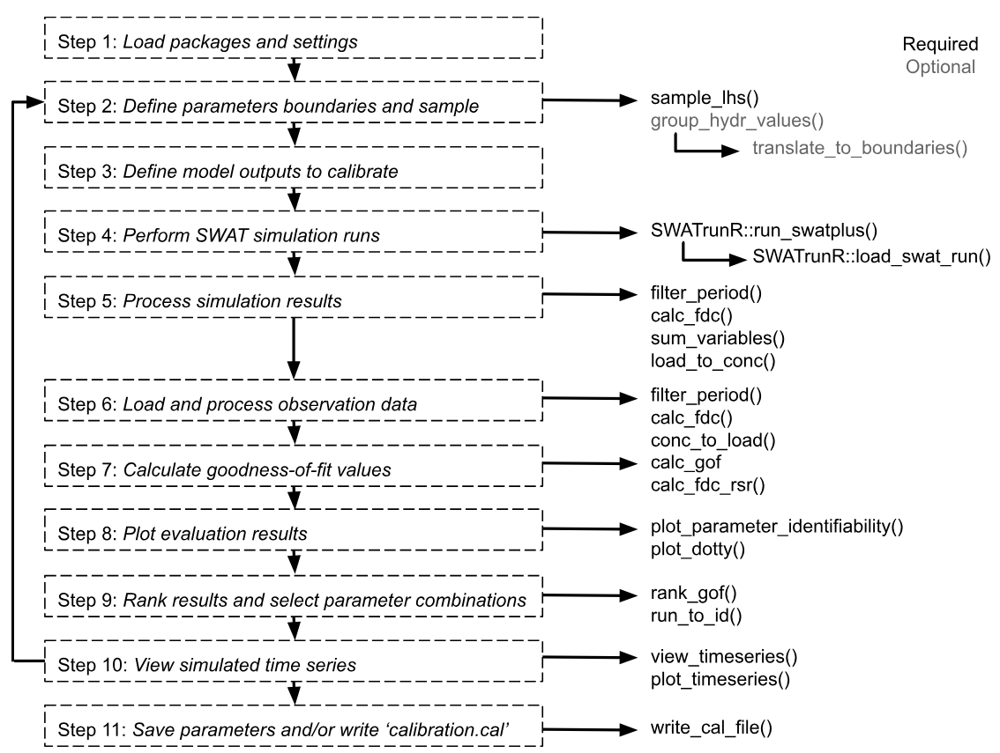

# Introduction

The **SWATrunR** package provides a framework and a set of tools for the hard calibration of SWAT models. At its core is a workflow generated by the `initialize_hardcal()` function. This function creates four R scripts in a folder named `workflow`, dividing the process into five distinct steps to facilitate calibration and avoid a lengthy and cumbersome script.

* **01_define_parameters.R** – defines the parameters to be calibrated.
* **02_define_output.R** – specifies the model outputs to be saved (or calibrated).
* **03_run_swat.R** – performs the SWAT model simulations.
* **04_analyze_results.R** – analyzes the simulation results and compares them to observations.
* **05_validate.R** - validates the calibrated model with an independent dataset. 

The workflow is fully customizable to suit specific calibration needs. Each script contains all necessary guidance in the form of code comments. This web page provides an overview of the workflow and its individual steps.

# Workflow Steps

Full workflow would be divided into 11 steps. The 1-2 steps in the **01_define_parameters.R**, 3 - **02_define_output.R**, 4 - **03_run_swat.R**  and the rest in **04_analyze_results.R**. The **05_validate.R** script provides a simple example of validation with 3 additional steps. The first two steps are described in this page, the rest in the next pages. This page corresponds to the `01_define_parameters.R` script.

```{r hc, echo=FALSE, out.width='95%', fig.align='center'}

```

# 1. Load packages and settings

Loading the required packages and settings is the first step in the workflow. 

```{r hc1, message = FALSE, warning = FALSE, eval = FALSE}
# Load required R packages ------------------------------------------------
library(SWATtunR)
library(SWATrunR)
library(hydroGOF)
library(tidyverse)
library(tibble)
library(purrr)
library(lhs)

# Parameter definition ----------------------------------------------------
# Number parameter combinations
n_combinations <- 1000

# Path to the SWAT+ project folder.
model_path <- 'test/swatplus_rev60_demo'
```

# 2. Define parameters {#hc_step2}

The following section provides a suggested list and range of SWAT+ parameters for calibrating different output variables. Parameters are roughly grouped according to the processes they most strongly influence. Some of these parameter groups are optional and may be included or excluded depending on the specific objectives of the calibration.

```{r hc2, message = FALSE, warning = FALSE, eval = FALSE}
parameter_boundaries <- tibble(
  # snow (optional - use if average snow fall to precipitation ratio is
  # higher than 5%)
  'snomelt_tmp.hru | change = absval' = c(-1.5, 1.5),
  'snofall_tmp.hru | change = absval' = c(-1.5, 1.5),
  'snomelt_lag.hru | change = absval' = c(0, 1),
  'snomelt_min.hru | change = absval' = c(1, 3.5),
  'snomelt_max.hru | change = absval' = c(3.5, 7),
  # ET (note: it is suggested that a narrow range for esco selected in soft
  # calibration of water balance is used instead of the wide (0,1) range)
  'esco.hru | change = absval' = c(0.05, 1),
  'epco.hru | change = absval' = c(0.05, 1),
  'awc.sol | change = relchg' = c(-0.25, 0.25),
  #surface runoff
  'cn2.hru | change = relchg' = c(-0.15, 0.10),
  'cn3_swf.hru | change = absval' = c(0, 1), # Normalized range. Will be updated below
  'ovn.hru | change  = relchg ' = c(-0.25, 0.25),
  'surlag.bsn | change = absval' = c(0.005, 4),
  # lateral flow (optional - use if lateral flow constitutes at least 5% of
  # total water yield)
  'lat_len.hru | change = abschg' = c(-20, 20),
  'latq_co.hru | change = absval' = c(0, 1), # Normalized range. Will be updated below
  'bd.sol | change = relchg' = c(-0.35, 0.35),
  'k.sol | change = relchg' = c(-0.5, 2),
  # tile flow (optional - use if tile flow constitutes at least 5% of total
  # water yield; note: tile_lag and tile_dtime should be active only if
  # tile_drain is set to 0 in codes.bsn file))
  'tile_dep.hru | change = relchg' = c(0.1, 0.3),
  'tile_lag.hru | change = absval' = c(20, 25),
  'tile_dtime.hru | change = absval' = c(50, 100),
  # percolation/aquifer
  'perco.hru | change = absval' = c(0, 1), # Normalized range. Will be updated below
  'flo_min.aqu | change = abschg' = c(-2, 2),
  'revap_co.aqu | change = absval' = c(0.02, 0.2),
  'revap_min.aqu | change = abschg' = c(-2, 2),
  'alpha.aqu | change = absval' = c(0.001, 0.1),
  'sp_yld.aqu | change = absval' = c(0.001, 0.05),
  'bf_max.aqu | change = absval' = c(0.5, 2),
  # channel routing
  'chn.rte | change = absval' = c(0.02, 0.3),
  'chs.rte | change = relchg' = c(-0.2, 0.2),
  # sediment routing
  'cov.rte | change = absval' = c(0.005, 1),
  'bedldcoef.rte | change = absval' = c(0.01, 1),
  'cherod.rte | change = absval' = c(0.05, 1),
  # nitrogen parameters from here
  "n_updis.bsn | change = absval" = c(10, 80),
  "nperco.bsn | change = absval" = c(0.5, 1),
  "sdnco.bsn | change = absval" = c(0.75, 0.9),
  "hlife_n.aqu | change = absval" = c(0, 200),
  "no3_init.aqu | change = absval" = c(0, 30),
  "cmn.bsn | change = absval" = c(0.001, 0.0013),
  "rsdco.bsn | change = absval" = c(0.02, 0.1)
  )

# Sample parameter combinations -------------------------------------------
parameter_set <- sample_lhs(parameter_boundaries, n_combinations)
```

## Applying different ranges to `cn3_swf`, `latq_co`, and `perco`

This step is optional and should be removed if you do not wish to apply different parameter ranges based on the initial values of the parameters `cn3_swf`, `latq_co`, and `perco`. By default, the SWAT+ model assigns different initial values to these parameters during setup, based on the runoff and leaching potentials of the respective HRUs. To preserve this spatial variability, it is recommended to calibrate these parameters using different ranges that correspond to their initial values.

The following routine ensures this by generating multiple parameter columns from a single sampled column. Note that the parameter must have been sampled earlier within the range of 0 to 1, so it can now be translated into different sub-ranges. These sub-ranges can also be narrowed further as part of the calibration process.

In this step, the HRUs of the SWAT+ model setup are separated into groups based on their initial values of `perco`, `cn3_swf`, and `latq_co`.

```{r hc21, message = FALSE, warning = FALSE, eval = FALSE}
# Separate the HRUs of the SWAT+ model setup into groups based on their initial
# values of e.g. perco, cn3_swf, and latq_co
perco_groups <- group_hydr_values('perco',   model_path)
cn3_groups   <- group_hydr_values('cn3_swf', model_path)
latq_groups  <- group_hydr_values('latq_co', model_path)

# Define parameter boundaries in which the parameter values should vary for
# the different initial values.
# The list can be a named list, the names defined here will be added to the
# parameter names for differentiation. If unnamed the indexes _1, _2, and _3
# will be added to the parameter names instead.
#
# Only provide the same numbers of ranges as numbers of individual parameters
# identified in the lines 105 to 107. Otherwise an error will occur in the
# following routine.
perco_bound <- list(low = c(0.05, 0.30), mod = c(0.30, 0.60), high = c(0.50, 0.95))
cn3_bound   <- list(low = c(0.00, 0.30), mod = c(0.15, 0.45), high = c(0.50, 0.95))
latq_bound  <- list(low = c(0.01, 0.30), mod = c(0.10, 0.40), high = c(0.50, 0.90))

# Add the additional parameter columns to the parameter table and remove the
# column with the respective normalized parameter values.
parameter_set <- translate_to_boundaries(par_tbl = parameter_set,
                                         par_name = 'perco.hru | change = absval',
                                         par_bound = perco_bound,
                                         par_group = perco_groups)

parameter_set <- translate_to_boundaries(par_tbl = parameter_set,
                                         par_name = 'cn3_swf.hru | change = absval',
                                         par_bound = cn3_bound,
                                         par_group = cn3_groups)

parameter_set <- translate_to_boundaries(par_tbl = parameter_set,
                                         par_name = 'latq_co.hru | change = absval',
                                         par_bound = latq_bound,
                                         par_group = latq_groups)
```
