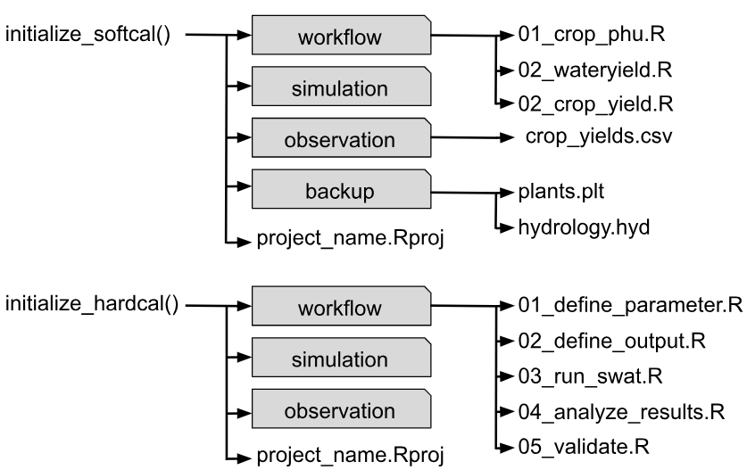

```{r setup, include=FALSE}
knitr::opts_chunk$set(echo = TRUE)
```

# Initialization

Before beginning calibration with the **SWATtunR** package, users must establish a calibration project by setting up a well-organized directory containing essential files and folders to support the calibration process. The package offers automated functions to streamline this setup, ensuring all necessary components are included. Additionally, it provides example data and workflow scripts with explanations and examples to help users start efficiently.

The SWATtunR package offers two main functions, `initialize_softcal()` and `initialize_hardcal()`, requiring a project name, calibration project save path, and SWAT+ model setup path as inputs. These functions automatically set up a calibration project, including a folder structure, example data, and a workflow script. The project structure, though slightly varying by function, includes a 'Workflow' folder with adaptable R scripts (notably ordered for hard calibration), a 'Simulation' folder for storing SWATrunR results in `*.sqlite` files with timestamps, an 'Observation' folder for data like daily streamflow, and a 'Backup' folder for modified files (e.g., plants.plt). An `*.Rproj` file is also included in the main directory to facilitate script execution.

```{r init, echo=FALSE, out.width='80%', fig.align='center'}

```

# Examples

Examples of function usage are provided below, illustrating how to initialize a calibration project for both soft and hard calibration workflows.

```{r ini1, message = FALSE, warning = FALSE, eval = FALSE}
initialize_softcal(project_name = 'softcal_test', 
                   path = 'Path:/to/directory', 
                   model_path = 'Path:/to/txt_inout')
```

```{r ini2, message = FALSE, warning = FALSE, eval = FALSE}
initialize_hardcal(project_name = 'hardcal_test', 
                   path = 'Path:/to/directory', 
                   model_path = 'Path:/to/txt_inout')
```

# Example setup

In case you want to test the package without setting up your own project, or if you want to replicate the results provided in the examples, you can use the example SWAT+ model setup and data included in this package. The setup has been obtained from the [SWATdata](https://github.com/chrisschuerz/SWATdata) R package, and the accompanying data are described in [@bosch2007]. The following code demonstrates how to access the example (test) model setup and data from the installed package. The files `crop.csv` (crop yield statistics) and `q.csv` (discharge data in m³/s) contain monitoring data at the catchment outflow, while `swatplus_rev60_demo.zip` includes all the necessary files for the SWAT+ model setup, as well as GIS data for reaches, the basin, and HRUs.


```{r ini3, message = FALSE, warning = FALSE, eval = FALSE}
temp_path <- system.file("extdata/example", package = "SWATtunR")
```
The SWAT+ model setup in the specified path can be used with the `initialize_softcal()` or `initialize_hardcal()` functions to set up working projects for soft or hard calibration.

# References

