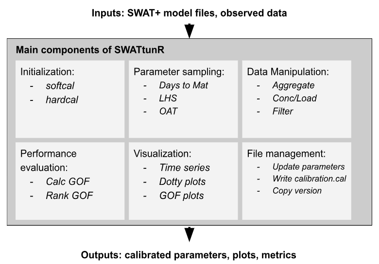
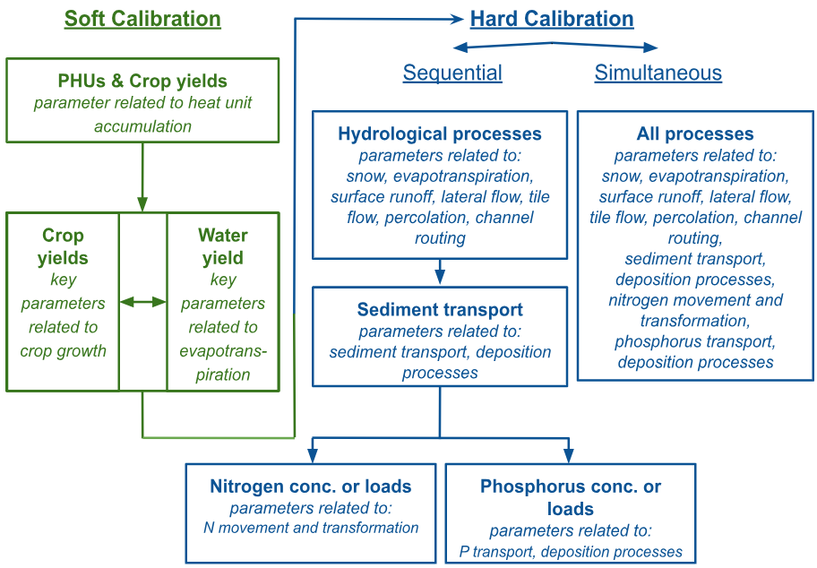

```{r setup, include=FALSE}
knitr::opts_chunk$set(echo = TRUE)
```


# Introduction to SWATtunR

**SWATtunR** is an open-source R package designed to automate and enhance the calibration and validation of SWAT+ (Soil and Water Assessment Tool) models. It provides a flexible and comprehensive suite of functions and workflows to support users in building fully scripted, reproducible hydrological modeling processes in R.

The package integrates with other SWAT-related R packages as [SWATbuildR](https://github.com/chrisschuerz/SWATbuildR), [SWATprepR](https://biopsichas.github.io/SWATprepR/), [SWATfarmR](http://chrisschuerz.github.io/SWATfarmR/), [SWATdoctR](https://git.ufz.de/schuerz/swatdoctr), [SWATrunR](https://chrisschuerz.github.io/SWATrunR/), [SWATmeasR](https://github.com/chrisschuerz/SWATmeasR), [SWATreadR](https://github.com/chrisschuerz/SWATreadR), and [SWATdata](https://github.com/chrisschuerz/SWATdata) — forming a powerful and interoperable ecosystem of tools for hydrological and environmental modelers working with SWAT/SWAT+ models.

#### Key functionalities of **SWATtunR** include:

* Workflow initialization and setup
* Parameter sampling strategies
* Input and output data manipulation
* Performance evaluation metrics
* Advanced visualization of calibration and validation results
* Model file management tools

To use **SWATtunR**, users must provide a working SWAT+ model setup along with the corresponding observed data. The package then guides in performing calibration and validation by adjusting parameters in three key SWAT+ input files:

* `plants.plt` – crop yield (soft calibration)
* `hydrology.hyd` – water yield ratio (soft calibration)
* `calibration.cal` – model calibration parameters (hard calibration)

```{r fig1, echo=FALSE, out.width='80%', fig.align = 'center'}

```

# Calibration Workflow

The calibration process in **SWATtunR** is divided into two main stages: *soft* and *hard* calibration.

**Soft calibration** focuses on improving plant growth and water balance without altering core model dynamics. It involves:

* **Step 1**: Calibrate the crop growth parameter (`days_mat`) to achieve reasonable Plant Heat Unit (PHU) fractions before harvest (typically between 1.00 and 1.25).  
* **Step 2–3 (Optional)**: Adjust additional crop yield parameters (`lai_pot`, `harv_idx`, `tmp_base`, `bm_e`) to align simulated yields with observed data.  
* **Step 2–3**: Calibrate evapotranspiration components (`esco`, `epco`) to match observed water yield ratios.


If crops fail to reach full maturity or the yield is unrealistic, crop management or the parameter ranges may need revision.

**Hard calibration** fine-tunes model parameters to observed discharge, sediment, and nutrient data. Two strategies are supported:

* **Sequential calibration**: Stepwise adjustment of hydrological, sediment, and nutrient processes.
* **Simultaneous calibration**: Joint tuning of all processes, improving fit for interrelated components like streamflow, nutrients, and sediments.

SWATtunR supports flexible workflows, including multi-site calibration, use of hydrological signatures, and multi-criteria performance evaluation to ensure robust model performance across varying conditions.

```{r cal_wf, echo=FALSE, out.width='80%', fig.align='center'}

```


