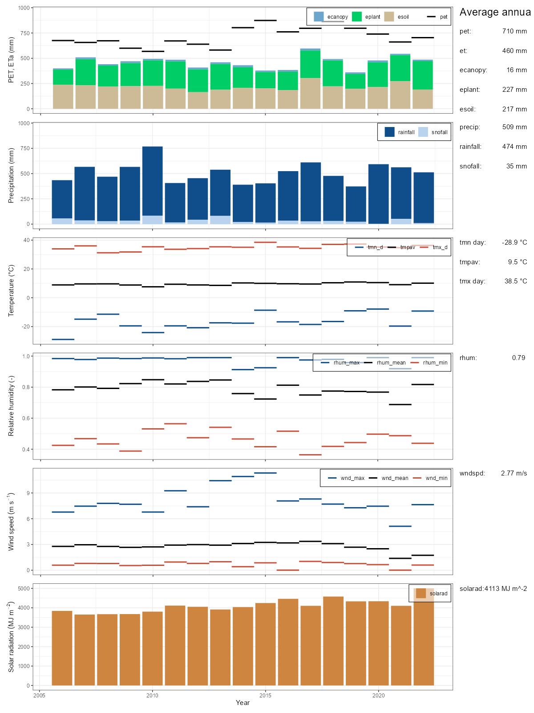
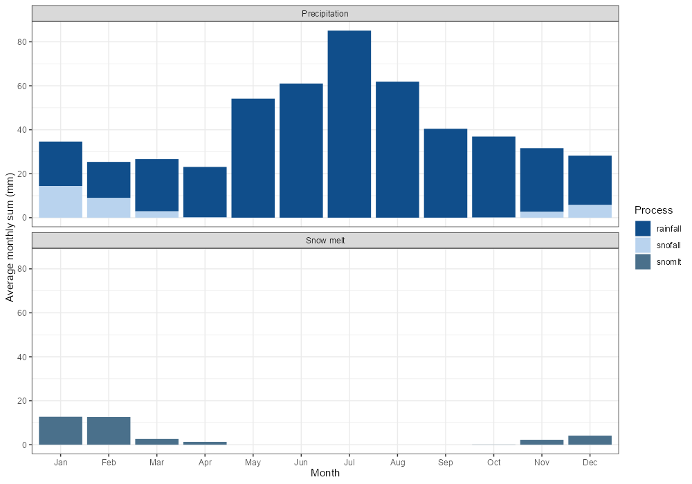
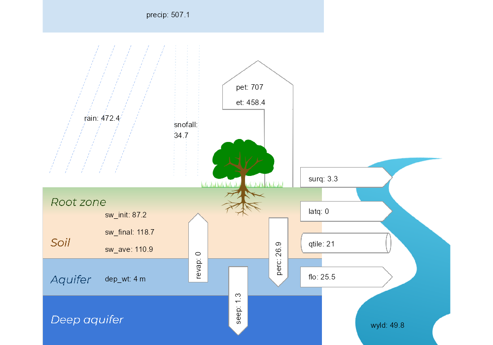
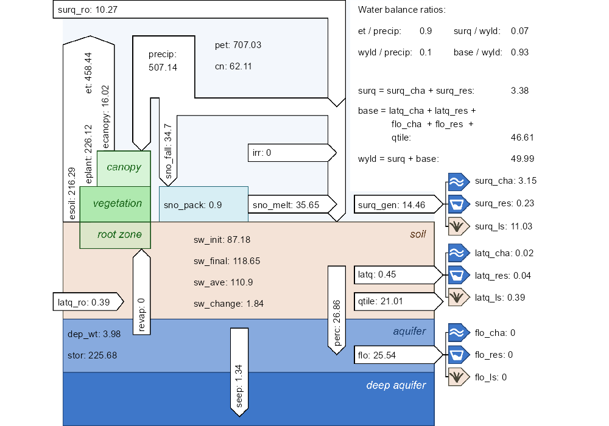

```{r setup, include=FALSE}
knitr::opts_chunk$set(echo = TRUE)
```

The first step analyzes the model simulated weather inputs and water balance components. A comparison to literature values and observation data allows the user to verify if the weather input data are interpreted correctly and water balance results are plausible.

## 1. Analysis of simulated annual climate variables {#qa1_step1}

The plot below gives an overview of the annual simulated basin average weather inputs. The simulated values should be in plausible ranges and must be comparable to literature values, before continuing with further model verification steps. The plot panels for relative humidity and wind speed will show all 0 values if a SWAT+ model revision lower than 60.5.5 was used in the simulation. A verification of the simulated relative humidity and wind speed cannot be done with this plot then. Please consider the points in the following checklist to verify the simulated weather data:

### PET and ET

-   Is the average annual PET plausible compared to regional PET?
-   Is the variability of PET plausible?

\>\> The simulation of PET is influenced by weather inputs such as temperature, relative humidity, wind speed, and solar radiation. Simulated values which significantly differ to region specific literature values can indicate issues with other weather inputs (see also other plot panels).

\>\> Adjustments of PET can be achieved by small (!) changes in the parameter `pet_pmpt` (which may be considered in the water balance soft calibration).

-   Is the average annual ET plausible compared to regional ET (if available)?
-   Are the proportions between `eplant`, `esoil`, and `ecanopy` reasonable. In vegetated areas `eplant` should be the dominant part of `et`.

\>\> Low overall `et` can indicate issues in the simulation of plant growth.

\>\> Low `eplant` compared to `esoil` can indicate issues in the simulation of plant growth.

### Precipitation and snow fall

-   Are the annual precipitation sums in a plausible range?
-   Is the fraction of snowfall compared to the precipitation sum plausible?

\>\> Large differences between simulated and observed precipitation can indicate issues in the precipitation input data.

\>\> If snowfall strongly differs from expected values this can indicate issues with the temperature input data, or model parameters such as `snofall_tmp` (snowfall temperature).

### Temperature

-   Are the daily minimum and maximum temperatures in plausible ranges?
-   Are the annual mean temperature values and the average annual mean temperature comparable to region specific temperature statistics?

### Relative humidity

-   Are the relative humidity records in a range between 0 and 1?
-   If available do average values compare to region specific statistics?

### Wind speed

-   Are the annual mean/min/max wind speeds in a plausible range?

### Solar radiation

-   Are the annual solar radiation sums comparable to region specific statistics?

```{r plot_climate_annual, eval = FALSE}
plot_climate_annual(sim_nostress)
```

```{r plot_plot_climate_annual, echo=FALSE, out.width='100%', fig.align = 'center'}
## Read the saved simulation results, plot to object, save to file and display
# p <- plot_climate_annual(sim_nostress)
# ggsave(p, file='figs/plot_climate_annual.png' , width=1200, height=1600, units = 'px', dpi = 100)

```

## 2. Seasonal dynamics of the precipitation and snow processes {#qa1_step2}

This is an optional check for catchments where snowfall and snowmelt play a role. The upper plot panel shows the monthly average sums of precipitation separated into rainfall and snowfall. The plot should help to verify if start and end month seem plausible for snowfall to occur and if the fractions of snowfall compared to the total precipitation seem plausible.

The second plot panel shows the runoff that is generated by snowmelt. This plot should help to verify the snomelt dominated runoff in spring.

If the weather inputs were verified in the section above and no major issues are present in the weather inputs, any visible issues in this verification step can indicate problematic parametrizations of the SWAT+ snow parameters such as `snofall_tmp` (snowfall temperature) and `snomelt_tmp` (snowmelt temperature).

```{r plot_monthly_snow, eval = FALSE}
plot_monthly_snow(sim_nostress)
```

```{r plot_plot_monthly_snow, echo=FALSE, out.width='100%', fig.align = 'center'}
## Read the saved simulation results, plot to object, save to file and display
# p <- plot_monthly_snow(sim_nostress)
# ggsave(p, file='figs/plot_monthly_snow.png' , width=1000, height=700, units = 'px', dpi = 100)

```

## 3. Overall simulated water balance {#qa1_step3}

The plot below gives an overview of the overall simulated water balance. The water balance will be addressed in the soft calibration. It can be worth to have a quick look on the basin water balance components the verify if their shares of the overall water cycle are plausible and how the water yield ratio (wyld / precip) and the base flow ratio (base / wyld) already compare to the characteristics of the observed runoff. Some of the water balance components are also part of the weather inputs analysis. But this plots puts all components of the water cycle into perspective. You may have a look at the following aspects of the water balance:

- Is the `wyld` already in a plausible range or is it excessive or 0?

- Are all components of `wyld` (surface, lateral, and aquifer flow) active or is one of the components 0?

- Is the soil water storage in a plausible range (e.g. values much larger than 0 mm (e.g. ~ 100 mm) and lower than 600 mm)?

- Does water percolate to the aquifer. Otherwise groundwater flow cannot occur?

- If irrigation is implemented, is the value of `irr` > 0?

Two versions of `plot_waterbalance` function are available. The simplified version might be good to get overview, but the detailed version is more important to quality assurance. Below are two plots.

```{r plot_waterbalance, eval = FALSE}
plot_waterbalance(sim_nostress, simplified = TRUE)
```

```{r plot_plot_waterbalance1, echo=FALSE, out.width='100%', fig.align = 'center'}
## Read the saved simulation results, plot to object, save to file and display
# p <- plot_waterbalance(sim_nostress, simplified = TRUE)
# ggsave(p, file='figs/plot_waterbalance_s.png' , width=1000, height=700, units = 'px', dpi = 100)

```

```{r plot_waterbalance2, eval = FALSE}
plot_waterbalance(sim_nostress)
```

```{r plot_plot_waterbalance2, echo=FALSE, out.width='100%', fig.align = 'center'}
# p <- plot_waterbalance(sim_nostress)
# ggsave(p, file='figs/plot_waterbalance.png' , width=1000, height=700, units = 'px', dpi = 100)

```

## 4. Analysis of simulated water balance at the HRU level {#qa1_step4}


`check_hru_waterbalance` performs some checks for the simulated water balance components to identify potential issues. Most of the rules that were used in the check functions are adopted from SWATCheck (SWATCheck however performs the analyses at a basin and land use level). The returned table shows all HRUs for which at least one of the checks identified a potential issue. The checks should help to identify HRUs and land uses which should be further investigated (e.g. with daily time series plots of the variables using the functions `plot_hru_pw_day` or `plot_hru_var`). In the example below checks were run for ET (`et`), soil water (`sw`), and the curve number (`cn`). Some land uses may always flag issues for some of the checks. So in the example below they were ignored in the checks. `ignore_lum = c('^u', '^wet')` means that all landuses which begin with the letter 'u' (in this case urban land uses) and all wetland land uses (begin with 'wet') were ignored.

```{r hru_wb_check, eval = FALSE}
hru_wb_check <- check_hru_waterbalance(sim_nostress, 
                                       check = c('et', 'sw', 'cn'),
                                       ignore_lum = c('^u', '^wet'))
rmarkdown::paged_table(hru_wb_check)
```

```{r table_hru_wb_check, echo=FALSE, out.width='100%', fig.align = 'center'}
# write.csv(hru_wb_check, file = 'hru_wb_check.csv')
hru_wb_check <- read.csv('data/hru_wb_check.csv')
rmarkdown::paged_table(hru_wb_check)
```

To continue the analysis, please proceed to [step 2](../articles/qa-st2.html). 
