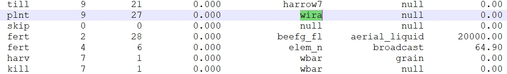

```{r setup, include=FALSE}
knitr::opts_chunk$set(echo = TRUE)
```

Second step focus on identification of any problems with the simulation of agricultural management operations.

## 1. Issues with scheduled and triggered management operations {#qa2_step1}

`report_mgt` gives an overview of operations which differ between the scheduled operations and the ones which were actually triggered during the simulation run. If differences are identified they must be further investigated. Identified differences must not necessarily be an error, but can also result e.g. from operations which are triggered by decision tables. A manual, visual investigation should rule out these cases. In this example one issue was identified. 

```{r mgt_report, eval = F}
mgt_report <- report_mgt(sim_nostress)
if(!is.null(mgt_report)) {
  rmarkdown::paged_table(mgt_report)
}
```

```{r table_mgt_report, echo=FALSE, out.width='100%', fig.align = 'center'}
# saveRDS(mgt_report, 'data/mgt_report.rds')
mgt_report <- readRDS('data/mgt_report.rds')
rmarkdown::paged_table(mgt_report)
```

## 2. Analize differences in management for an HRU {#qa2_step2}

If the management report above flagged the management for an HRU to be different, the following code can help to look into the operations which were found different in the scheduled and triggered management.

```{r sel_case}
##Select a case to examine
sel_nb <- 1
sel_mgt <- mgt_report[[sel_nb,"schedule"]]
print(paste("Table of issues for selected management", sel_mgt))
mgt_report$schedule_report[[sel_nb]]
```

To analyze the full triggered management table for the same HRU how it was printed by the SWAT+ simulation run the following lines of code.

```{r sel_case2, eval = F}
id <- get_hru_id_by_attribute(sim_nostress, mgt = sel_mgt)$id[1]
print(paste("HRU", id, "trigerred management table"))
print_triggered_mgt(sim_verify = sim_nostress, hru_id = id)
```

```{r plot_mgt, echo=FALSE, out.width='100%', fig.align = 'center'}
print(paste("HRU", 16, "trigerred management table"))
# t1 <- print_triggered_mgt(sim_verify = sim_nostress, hru_id = id)
# saveRDS(t1, 'data/t1.rds')
t1 <- readRDS('data/t1.rds')
rmarkdown::paged_table(t1)
```

We can also open *'management.sch'* file to see the scheduled management operations for the HRU. In this case the error is that `'wira'` plant is planted, but `'wbar'` is harvested. This is a clear error in the management schedule.


```{r mgt, echo=FALSE, out.width='100%', fig.align = 'center'}

```

To continue the analysis, please proceed to [step 3](../articles/qa-st3.html). 


