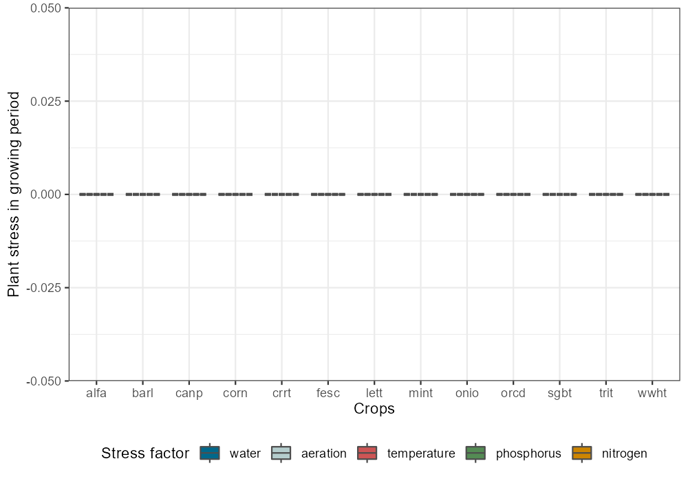
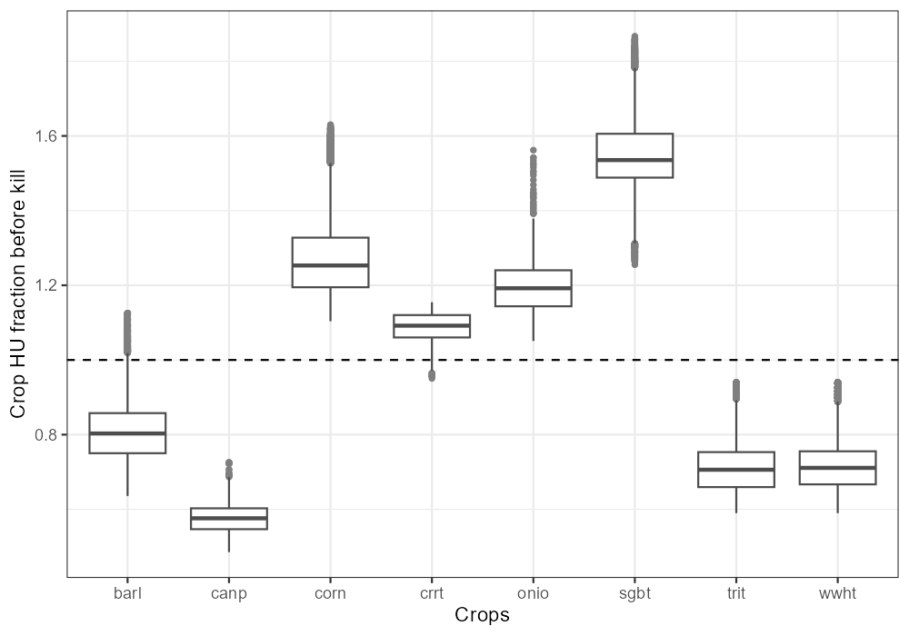
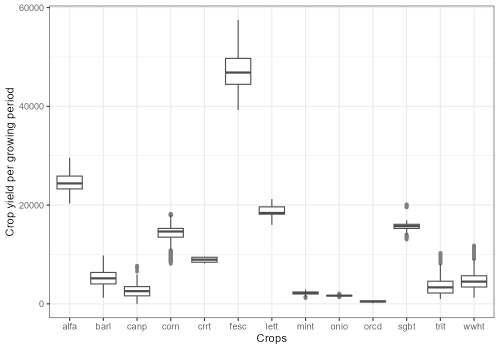
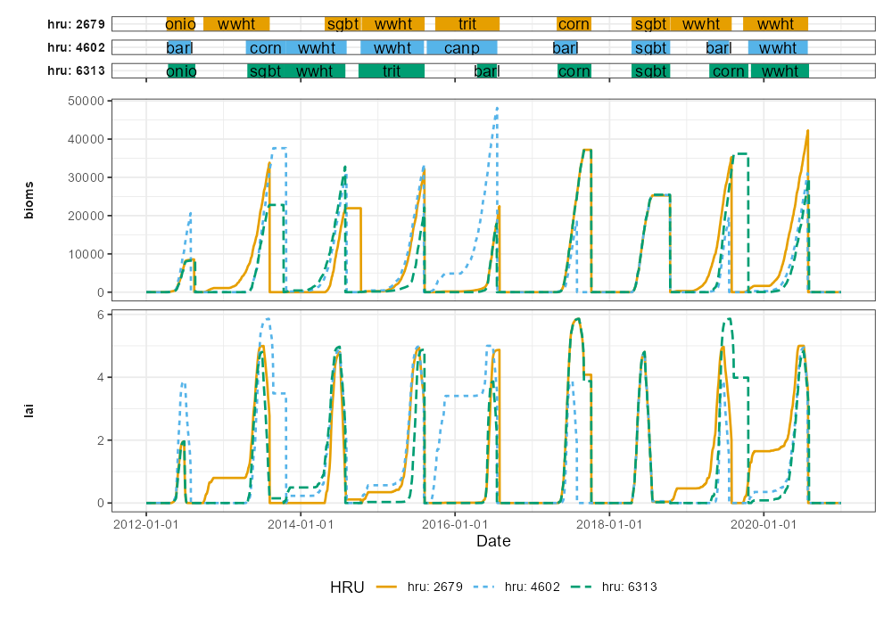

```{r setup, include=FALSE}
knitr::opts_chunk$set(echo = TRUE)
```

Examinig the unconstrained plant growth is the next step in the model setup verification. This step is important to verify if the selected plants and growing periods lead to plausible potential plant growth. The following steps are important to examine.

## 1. Plant stress {#qa3_step1}

Plant growth without any simulated plant stress should result in the potential biomass or yield a plant can gain given the climatic and soil conditions of the simulated catchment. This step should focus on the verification of the duration of the scheduled growing period or if the selected crop parametrizations meet the climatic conditions. The crop specific analyses in this step can be performed with the function `plot_variable_at_harvkill`. First check if all plant stresses were really deactivated in the simulations (The figure should show all 0 values):

```{r stress, eval = F}
plot_variable_at_harvkill(sim_nostress, variable = 'stress')
```

```{r plot_stress, echo=FALSE, out.width='100%', fig.align = 'center'}
# p <- plot_variable_at_harvkill(sim_nostress, variable = 'stress')
# ggsave(p, file='figs/plot_stress.png' , width=1000, height=700, units = 'px', dpi = 150)

```

## 2. Potential heat unit fractions {#qa3_step2}

A relevant indicator for the duration of the growing period is the potential heat unit fraction. A value of 1 means that a plant reached full maturity. Some grains should additionally dry off on the field. Thus a value of ~1.2 should be reached. The following plot should help you to see if the crops in the scheduled managements reach maturity. Crops which show many values smaller than 1 must be further analyzed. But also values much larger than 1 must be treated as implausible and require to perform further analyses.

```{r phu, eval = F}
plot_variable_at_harvkill(sim_nostress, variable = 'phu')
```

```{r plot_phu, echo=FALSE, out.width='100%', fig.align = 'center'}
# p <- plot_variable_at_harvkill(sim_nostress, variable = 'phu')
# ggsave(p, file='figs/plot_phu.png' , width=1000, height=700, units = 'px', dpi = 150)

```

## 3. Unconstrained yields {#qa3_step3}

If the potential heat unit fractions are in a plausible range the unconstrained yields can be analyzed. The plotted values will likely be larger than region specific literature values, but should not be much lower than literature values. Otherwise this indicates a potential issue with the development of the respective crop:

```{r yield, eval = F}
plot_variable_at_harvkill(sim_nostress, variable = 'yield')
```

```{r plot_yield, echo=FALSE, out.width='100%', fig.align = 'center'}
# p <- plot_variable_at_harvkill(sim_nostress, variable = 'yield')
# ggsave(p, file='figs/plot_yield.png' , width=1000, height=700, units = 'px', dpi = 150)

```

## 4. Further analysis of identified issues {#qa3_step4}

If for example unusually high heat unit values, or low (almost zero) yields are identified these must be further investigated. This can be done by first filtering the HRUs that show the issue and then perform some more detailed plots which may support the identification of the issue. 

You can filter for HRUs of interest with the function `filter_hru_at_harvkill`. The function could be used with one or multiple `crop`, `phu`, `plant_bioms`, `yield`, `water_stress`, `aero_stress`, `temp_stress`, `n_stress` and `p_stress` variables. The example below filters HRUs with large PHU values at harvest kill. 

```{r high_phu, eval=FALSE}
high_phu <- filter_hru_at_harvkill(sim_nostress, phu > 1.86)
high_phu
```

```{r plot_high_phu, echo=FALSE, out.width='100%', fig.align = 'center'}
# saveRDS(high_phu, 'data/high_phu.rds')
high_phu <- readRDS('data/high_phu.rds')
high_phu
```

If you then want to look into the crop development over time you can do that for example with the function `plot_hru_pw_day`. In this example high PHU values were found for sugar beets, but ofor the HRU #2679, #4602 and #6313. Below the function plots the LAI and the bio mass development for crops on this HRU over several years.

```{r hru_pw_day, eval=FALSE}
plot_hru_pw_day(sim_nostress, 
                hru_id = c(2679, 4602, 6313), 
                var = c('lai', 'bioms'), 
                years = 2012:2020, 
                add_crop = TRUE)
```

```{r plot_hru_pw_day, echo=FALSE, out.width='100%', fig.align = 'center'}
# p <- plot_hru_pw_day(sim_nostress, hru_id = c(2679, 4602, 6313), var = c('lai', 'bioms'), years = 2012:2020, add_crop = TRUE)
# ggsave(p, file='figs/plot_hru_pw_day.png' , width=1000, height=700, units = 'px', dpi = 120)

```

To continue the analysis, please proceed to [step 4](../articles/qa-st4.html). 
