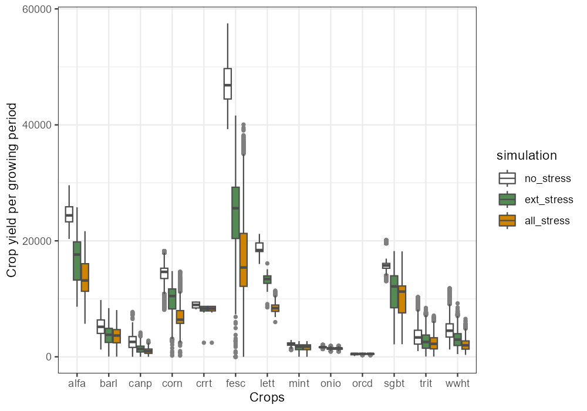
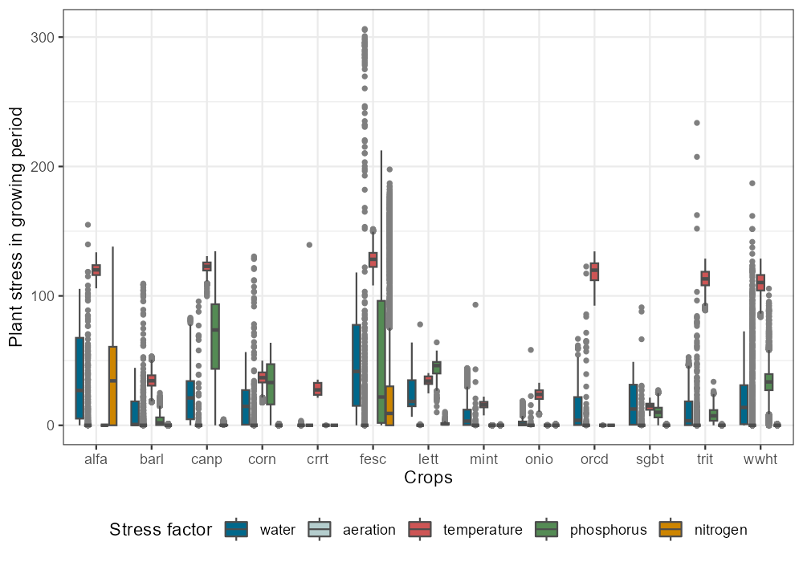

```{r setup, include=FALSE}
knitr::opts_chunk$set(echo = TRUE)
```

When the plant growth without active stress factors is checked for plausibility, plant growth must be analyzed when plant stresses are active. There are two options how the effect of simulated plant stresses can be analyzed, i) to only consider water, aeration and temperature stress and thus to only analyze the impact of external conditions such as weather and soil, and ii) to also include nitrogen and phosphorus stress, and thus to also account for limitations in plant growth due to insufficient nutrient supply. 

## 1. Running the SWAT+ model (with plant stress factors active) {#qa4_step1}

Before the individual stress factors can be analyzed, we have to run the simulations and extract the required simulation outputs. Below the simulations are performed and saved for only external stress factors active (excluding nutrient stress factors).

```{r run2, eval = FALSE}
sim_extstress <- run_swat_verification(project_path = model_path,
                                        outputs = c('wb', 'mgt', 'plt'),
                                        years_skip = 3,
                                        nostress = 2)

file_version <- get_file_version(parent_dir, save_name, '_extstr_') + 1
saveRDS(sim_extstress, file = paste0(parent_dir,'/', 
                                     save_name, '_extstr_', 
                                     file_version,'.rds'))
```

```{r qa_load2, eval = FALSE}
file_version <- get_file_version(parent_dir, save_name, '_extstr_')
sim_extstress <- readRDS(file = paste0(parent_dir,'/', 
                                       save_name, '_extstr_', 
                                       file_version,'.rds'))
```

We also run and save the simulations with all stress factors activated, for a comparison of yield declines due to the simulated stress factors.

```{r run3, eval = FALSE}
sim_allstress <- run_swat_verification(project_path = model_path,
                                       outputs = c('wb', 'mgt', 'plt'),
                                       years_skip = 3,
                                       nostress = 0)

file_version <- get_file_version(parent_dir, save_name, '_allstr_') + 1
saveRDS(sim_allstress, file = paste0(parent_dir,'/', 
                                     save_name, '_allstr_', 
                                     file_version,'.rds'))
```

```{r qa_load3, eval = FALSE}
file_version <- get_file_version(parent_dir, save_name, '_allstr_')
sim_allstress <- readRDS(file = paste0(parent_dir,'/', 
                                       save_name, '_allstr_', 
                                       file_version,'.rds'))
```

## 2. Compare yields with different stress factors activated {#qa4_step2}

We compare the simulated yields without simulated stress factors to the cases when only external stress factors are active and all stress factors are active. We can expect a decline in yields due to active stress. The decline should however be not too large. Particularly a large number of outliers at the lower end with yields close to 0 should raise our attention and should be further investigated. The differences between the simulations with only external stresses and all stresses active can be a good indicator whether the external factors or the nutrient inputs are the more dominant factors. Please consider the following check list:

- If you find a strong decline from `no_stres` to `ext_stress` then the used crops should be further investigated if their parametrizations are compatible with the climatic inputs. 

- If aeration stress is high (will be analyzed below), soil properties may be further investigated.

- If water stress is high (will also be analyzed below), this may indicate that rainfall is not sufficient and it must be further investigated if irrigation is actually applied and has to be considered in the management schedules.

- Increased temperature stress can indicate that the temperature inputs and the crop temperature parameters are not compatible. In such a case the crop parametrization may need further attention.

- If the decline from `ext_stress` to `all_stress` is large then limited nutrient supply may be the dominant factor. This can indicate insufficient fertilizer application in the management schedules.

```{r all_yield, eval=FALSE}
sim_list <- list(no_stress  = sim_nostress, 
                 ext_stress = sim_extstress, 
                 all_stress = sim_allstress)
plot_variable_at_harvkill(sim_list, variable = 'yield')
```

```{r plot_all_yield, echo=FALSE, out.width='100%', fig.align = 'center'}
# p <- plot_variable_at_harvkill(sim_list, variable = 'yield')
# ggsave(p, file='figs/plot_all_yield.png' , width=1000, height=700, units = 'px', dpi = 150)

```

## 3. Analyze the plant stress factors {#qa4_step3}

Where we expected the plant stress factors to be all 0 for the `sim_nostress` simulation runs, we will now have a look into the simulated stresses when all stress factors are active. The plotted results should be checked with the short check list above.

```{r allstress, eval=FALSE}
plot_variable_at_harvkill(sim_allstress, variable = 'stress')
```

```{r plot_allstress, echo=FALSE, out.width='100%', fig.align = 'center'}
# p <- plot_variable_at_harvkill(sim_allstress, variable = 'stress')
# ggsave(p, file='figs/plot_allstress.png' , width=1000, height=700, units = 'px', dpi = 150)

```

To continue the analysis, please proceed to [step 5](../articles/qa-st5.html). 
