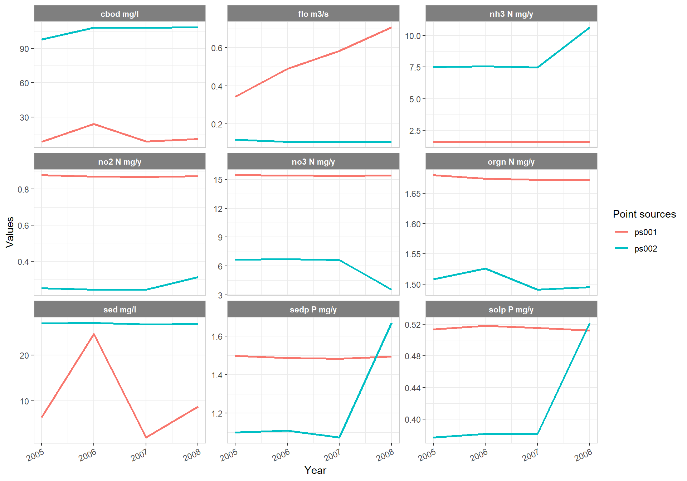
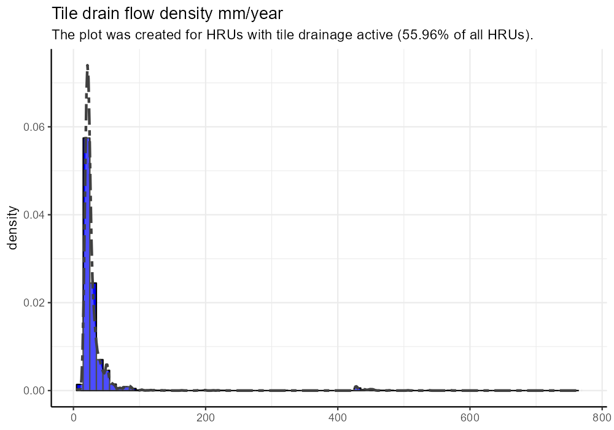

```{r setup, include=FALSE}
knitr::opts_chunk$set(echo = TRUE)
```

Point sources and tile flow outputs should be plausible before continuing with any model calibration. If point sources and/or tile drainage are implemented in you model setups run the following verification steps and analyze the plotted simulation outputs for plausibility, whether the simulated values are in acceptable ranges. 

## 1. Point sources {#qa5_step1}

To analyze implemented point source inputs run the following analysis. 

```{r ps, eval=FALSE}
plot_ps(sim_allstress, conc = TRUE)
```

```{r plot_ps, echo=FALSE, out.width='100%', fig.align = 'center'}
# p <- plot_ps(sim_allstress, conc = TRUE)
# ggsave(p, file='figs/pts.png' , width=1000, height=700, units = 'px', dpi = 150)

```

## 2. Tile drainage {#qa5_step2}

To analyze tile drainage if implemented in the model setup run the following analysis.

```{r qtile, eval=FALSE}
plot_qtile(sim_allstress)
```

```{r plot_qtile, echo=FALSE, out.width='100%', fig.align = 'center'}
# p <- plot_qtile(sim_allstress)
# ggsave(p, file='figs/plot_qtile.png' , width=1000, height=700, units = 'px', dpi = 150)

```

