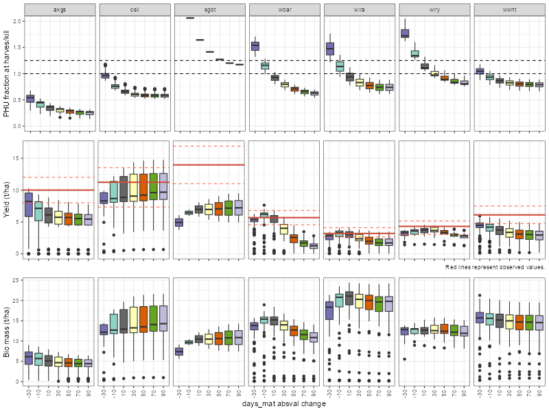
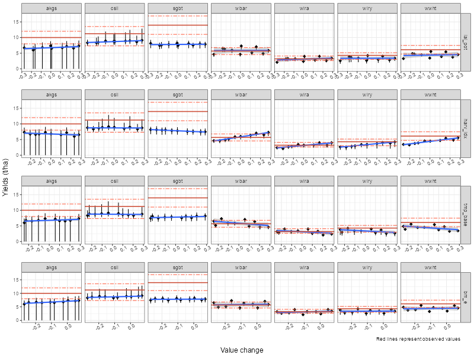
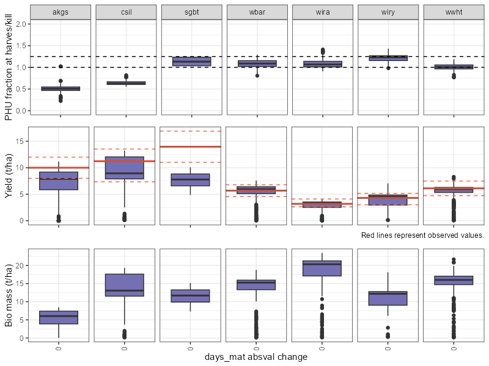

```{r setup, include=FALSE}
knitr::opts_chunk$set(echo = TRUE)
```

The aim of crop yield calibration is to adjust relevant crop parameters so that the SWAT+ simulation matches the observed crop yields. The workflow proposed below is based on the script that was initially developed in the EU project [OPTAIN](https://www.optain.eu/) and described in one of its [deliverables](https://zenodo.org/records/11233622). The reader is referred there for more information about the workflow and the results of its application in several case studies in Europe.

## 1. Loading required packages {#scc_step1}

The `SWATtunR` package is essential for soft calibration, as it provides the necessary functions for the calibration process. Additional packages are required for data manipulation, visualization, SWAT+ model runs, etc.

```{r libraries, message = FALSE, warning = FALSE}
## Required libraries to run workflow
library(SWATtunR)
library(SWATrunR)
library(tidyverse)
library(tibble)
library(purrr)
```

## 2. Defining settings {#scc_step2}

This step requires defining the SWAT+ model path, the path to the crop data file.

For the crop yield soft calibration, it's essential to have accurate data on observed crop yields expressed in dry matter weight. Since reference data is typically provided as fresh matter weight, the values need to be multiplied by crop-specific conversion factors prior to their use in calibration. In the proposed workflow, basin-averaged yield data are required, so this solution may not fit to large river basins with spatially heterogeneous yields. The data is typically sourced from a `'*.csv'` file, with columns specifying the plant names and their corresponding mean yields. If additional information is accessible, such as the minimum and maximum ranges for average annual observed yields, it's advisable to include them in the `'*.csv'` file as well, under the columns labeled yield_min and yield_max respectively. This ensures a comprehensive dataset for effective calibration and analysis.

```{r settings, message = FALSE, warning = FALSE}
# Path to the SWAT+ model
model_path <- '../test/my_dearest_model'

# Path to the crop data file
crop_data_path <- '../inst/extdata/crop2.csv'

# Set the path to save results of the soft calibration
sc_res <- '../test/simulations'

# Set the number of cores available for calculations.  
# Number of cores for 12 runs use 3, 4, 6, or 12 cores (if available)
cores <- 3
```

An example file with observed crop yields is provided below.

```{r crop_data, message = FALSE, warning = FALSE}
##
crops_obs <- read_csv(crop_data_path, show_col_types = FALSE) %>% 
  filter(!is.na(yield_mean))

head(crops_obs, 3)
```

## 3. Days to maturity parameter changes {#scc_step3}

In the proposed workflow, one preliminary step before the actual calibration of crop parameters is adjusting the new SWAT+ parameter `'days_mat'` (days to maurity) that replaced the older concept of heat units to maturity in previous SWAT versions. The goal is to set the potential heat units (PHU) fraction at harvest within a plausible ranges for different crop types.

It is recommended to check at this stage that the crop-specific values of the base temperature parameter (`'tmp_base'`) are realistic for the case study.

### 3.1. Initialization {#scc_step31}

The preparation of this step requires the conversion of observed yields information into numeric vectors and initialization of `'plants.plt'` file.

```{r init_dmat, message = FALSE, warning = FALSE}
# Convert observed yields to numeric vectors
for(i in c("yield_mean", "yield_min", "yield_max")){
  if(i %in% colnames(crops_obs)){
    assign(i, deframe(select(crops_obs, all_of(c("plant_name", i))))) 
  } else {
    assign(i, NULL)
  }
}

## Initialize unmodified backup version of plants.plt
if(!file.exists(paste0(model_path, '/plants.plt.bkp0'))) {
  copy_file_version(model_path, 'plants.plt', file_version = 0)
}
```

### 3.2. Days to maturity changes {#scc_step32}

The following code generates a parameter input table with changes for required for SWAT+ model run. The names are converted into [SWATrunR syntax](https://chrisschuerz.github.io/SWATrunR/articles/par_sampl_calib.html) for the days to maturity parameter. The code snippet also samples changes for days to maturity, allowing users to define the crops to be used in soft calibration and the initial values for days to maturity. Those initial values originate from the default plants database and may very likely lead to unreliable simulation of PHU fraction. In the example below, the addition factor to `'days_mat'` parameter varies between -30 and 100, which could be adjusted, if necessary.

```{r dmat, message = FALSE, warning = FALSE}
# Reading the plants.plt input file from the initial unchanged backup file
plants_plt <- read_tbl(file_path = paste0(model_path, '/plants.plt.bkp0'))
plants_plt <- select(plants_plt, - any_of('description'))

# Define all crops which should be calibrated
# Alternatively define a name vector (if you also want to consider crops 
# which are not given in the observation input file).
crops <- crops_obs$plant_name
# crops <- c('crop1', 'crop2', 'crop3')

# Get a vector with days_mat initial values for the selected crops
dmat_init <- plants_plt %>%
  filter(name %in% crops) %>% 
  select(name, days_mat) %>%
  mutate(days_mat = ifelse(days_mat == 0, 110, days_mat)) %>% 
  ## if days_mat is 0, set it to 110 (as it is the default value in the SWAT+ code)
  deframe()

# Sample changes for days to maturity. Depending on the number of cores you have 
# available choose a reasonable interval for the days to maturity which you want 
# to test. With an interval of 10 e.g. you have to do 12 simulations (3 rounds 
# on 4 cores), with an interval of 5 its 23 simulations.
dmat_step <- 20
dmat_chg <- round(seq(-30, 100, dmat_step))

# Generate the parameter input table with the changes for all crops and convert 
# the names into SWATrunR syntax
par_dmat <- map_df(dmat_init, ~ .x + dmat_chg) %>% 
  set_names(., paste0('dmat_', names(.),
                      '::days_mat.pdb | change = absval | name = ' , names(.)))

```

## 4. Run simulations for `'days_mat'` adjustment {#scc_step4}

In this step, [SWATrunR](https://chrisschuerz.github.io/SWATrunR/) package is used to run simulations with `'days_mat'` parameter varying in the predefined range, in order to analyze the PHU fractions, yields and biomass for selected crops.

```{r run_dmat, message = FALSE, warning = FALSE, eval = FALSE}
# make sure to adjust simulation settings (start date, end date and warm-up period) to your situation
ylds_phu_dmat <- run_swatplus(project_path = model_path,
                              output = list(yld = define_output(file = 'mgtout',
                                                                variable = 'yld',
                                                                unit = crops),
                                            bms = define_output(file = 'mgtout',
                                                                variable = 'bioms',
                                                                unit = crops),
                                            phu = define_output(file = 'mgtout',
                                                                variable = 'phu',
                                                                unit = crops)
                              ),
                              parameter = par_dmat,
                              start_date = '2015-01-01',
                              end_date = '2020-12-31',
                              years_skip = 2,
                              n_thread = cores)

# Optionally save the simulation runs.
if(!dir.exists(sc_res)) dir.create(sc_res)
saveRDS(ylds_phu_dmat, paste0(sc_res, "/ylds_phu_mat.rds"))
```

## 5. Plot PHU fractions, yields, and biomass for days to maturity changes {#scc_step5}

In this figure, we visualize the PHU fractions, yields, and biomass for various days to maturity settings. This graphical representation serves as a reference to adjust the initial values of `days_mat` for each crop in the simulation.

For grain crops, which typically dry off before harvest, aim for PHU fractions ranging from approximately *1.2* to *1.5* to optimize yield. Vegetables, on the other hand, tend to have a PHU fraction around *1*, possibly slightly above, which is considered optimal. Crops like basil and broccoli are harvested before reaching full maturity. In such cases, PHU fractions can be lower than *1*, ranging from *0.5* to *0.9*. Please note that values shown in the plot represent the first harvest. In case of multiple harvests (e.g. grassland, alfalfa), the PHU fraction should also be expected to be well below 1.

These are some generic suggestions, but it is recommended to check which PHU fractions should be the target in a given case study, as this can be both crop- and region-specific.

Furthermore, it is useful to check already at this stage if the simulated yields fall within the range of locally observed yields to maintain accuracy and relevance and how `'days_mat'` affects yields. The actual soft calibration of yields will be described in steps 8-11.

```{r plot_dmat_eval_f, message = FALSE, warning = FALSE, eval = FALSE}
plot_phu_yld_bms(ylds_phu_dmat, dmat_chg, yield_mean, yield_min, yield_max)
```

```{r plot_dmat_eval_t, echo=FALSE, out.width='100%', fig.align = 'center'}
## Read the saved simulation results, plot to object, save to file and display
# ylds_phu_dmat <- readRDS(paste0(sc_res, "/ylds_phu_mat.rds"))
# p <- plot_phu_yld_bms(ylds_phu_dmat, dmat_chg, yield_mean, yield_min, yield_max)
# ggsave(p, file='figs/ylds_phu_dmat.png' , width=800, height=600, units = 'px', dpi = 72)

```

## 6. Select days to maturity parameter changes to apply {#scc_step6}

Based on the figure provided, identify the necessary adjustments to the days to maturity parameter in the SWAT+ model. These adjustments should be made to ensure that the PHU fractions, yields, and biomass values of the specified crops align with the observed data.

```{r select_dmat, message = FALSE, warning = FALSE}
# Add values based on figure to this line (please add all crops from the initial selection)
# names(dmat_init) # Print all crop names
chg_dmat_sel <- c(akgs = -30, csil = 10, sgbt =  70, 
                  wbar =   -10, wira = -10, wiry =  0, wwht =  -30)


# Adding defined changes to initial days_mat values of crops
dmat_sel <- chg_dmat_sel[names(dmat_init)] + dmat_init
dmat_sel <- enframe(dmat_sel, value = 'days_mat_upd')
```

## 7. Write d_mat modifications into file {#scc_step7}

Write the changes to the `plants.plt` file to update the days to maturity values for the selected crops and also backup the updated file to `plants.plt.bkp1` file.

```{r plants_plt_write, message = FALSE, warning = FALSE}
# Update the days_mat values in plants.plt according to the changes defined above.
plants_plt <- plants_plt %>%
  left_join(., dmat_sel, by = 'name') %>%
  mutate(days_mat = ifelse(!is.na(days_mat_upd), days_mat_upd, days_mat)) %>%
  select(-days_mat_upd)

## Overwriting original plants.plt with the updated days_mat values.
plants_plt_fmt <- c('%-12s', '%-18s', '%-12s', rep('%12.5f', ncol(plants_plt) - 3))
write_tbl(plants_plt, paste0(model_path, '/plants.plt'), fmt = plants_plt_fmt)

# Create a backup file with the changed days_mat values
copy_file_version(model_path, 'plants.plt', file_version = 1)
```

## 8. Check initial crop lai_pot, harv_idx, tmp_base, bm_e parameters {#scc_step8}

After fixing the days to maturity values, it might be needed to address values of the `lai_pot`, `harv_idx`, `tmp_base`, and `bm_e` parameters for the selected crops. These parameters are crucial for the simulation and should be adjusted if PHU fractions, yields, and biomass values are not within the expected range.

```{r plants_plt_write2, message = FALSE, warning = FALSE}
plants_plt <- read_tbl(file_path = paste0(model_path, '/plants.plt'))

par_ini <- plants_plt %>%
  filter(name %in% crops) %>%
  select(name, lai_pot, harv_idx, tmp_base, bm_e)#, days_mat)
par_ini
```

## 9. Create sample of lai_pot, harv_idx, tmp_base, bm_e parameters with LHS {#scc_step9}

For this we will use the [sample_lhs](../reference/sample_lhs.html) function to create a sample of parameter values for the selected crops. The sample will be used to run SWAT+ simulations and evaluate the impact of the parameter changes on the model output. The syntax for the parameter boundaries could be found on the [SWATrunR page](https://chrisschuerz.github.io/SWATrunR/articles/SWATrunR.html#parameter-inputs).

```{r pars, message = FALSE, warning = FALSE}
## Define changes to be applied to the initial parameter values
## Make sure your updates will not produce unrealistic values (i.e. negative values)!!!
par_bnd <- tibble('lai_pot.pdb | change = relchg' = c(-0.3, 0.3),
                  'harv_idx.pdb | change = relchg' = c(-0.3, 0.3),
                  'tmp_base.pdb | change = relchg' = c(-0.3, 0.3),
                  # 'tmp_base.pdb | change = abschg' = c(-2, 2),
                  'bm_e.pdb | change = relchg' = c(-0.3, 0.1))

par_crop <- sample_lhs(par_bnd, 10) ## 10 samples for each parameter will be generated. 
## The number of samples can be adjusted based on the available computational resources.
## Recommended number of samples is 50-100.
```

## 10. Run SWATrunR for prepared parameter set {#scc_step10}

Run the SWAT+ model with the updated parameters for the selected crops should be rerun. The simulation results will be used to evaluate the impact of the parameter changes on the model output.

```{r run_par, message = FALSE, warning = FALSE, eval = FALSE}
ylds_plnt_par <- run_swatplus(project_path = model_path,
                              output = list(yld = define_output(file = 'mgtout',
                                                                variable = 'yld',
                                                                unit = crops)),
                              parameter = par_crop,
                              n_thread = cores)

## Save the results to the file
saveRDS(ylds_plnt_par, paste0(sc_res, "/ylds_plnt_par.rds"))
```

## 11. Examine results in figures {#scc_step11}

Plotting simulation results in dotty plots can help to identify parameter sensitivities and how to modify them. After examining the patterns in dotty plots, you may consider adjusting certain parameter ranges ([step 9](#scc_step9)) and then rerunning the model ([step 10](#scc_step10)) to observe any changes in the results. Subsequently, you can reanalyze the outcomes with [plot_dotty_yields](../reference/plot_dotty_yields.html) function to gain further insights or refine your understanding of the system being modeled.

```{r plot_dotty_eval_f, message = FALSE, warning = FALSE, eval = FALSE}
## Plot dotty figures for the selected crops
plot_dotty_yields(ylds_plnt_par, yield_mean, yield_min, yield_max)
```

```{r plot_dotty_eval_t,  echo=FALSE, out.width='100%', fig.align = 'center'}
## Read the saved simulation results, plot to object, save to file and display figure
# ylds_plnt_par <- readRDS(paste0(sc_res, "/ylds_plnt_par.rds"))
# p <- plot_dotty_yields(ylds_plnt_par, yield_mean, yield_min, yield_max)
# ggsave(p, file='figs/ylds_plnt_par.png', width=800, height=600, units = 'px', dpi = 72)

```

## 12. Update parameter values in plants.plt file {#scc_step12}

After examining the results of the SWAT+ simulations, you can adjust the parameter values in the `plants.plt` file. Not all parameters need to be changed, but only those that are sensitive might help to improve the model performance. Different crops exhibit different sensitivities to the parameters, so it is important to select parameters for each crop. Following code sniplet shows how to update the `plants.plt` file.

```{r plants_plt_write3, message = FALSE, warning = FALSE}
## Fix changes you want to write in plants.plt file
chg_par <- tibble(
  name     = c("akgs","barl", "csil", "sgbt", "wbar", "wira", "wiry", "wwht"),
  lai_pot  = c(    0,     0,      0,      0,      0,      0,      0,      0),
  harv_idx = c(    0,     0,      0,      0,      0,      0,    0.3,    0.3),
  tmp_base = c(    0,     0,      0,      0,      0,      0,   -0.2,   -0.2),
  bm_e     = c(    0,     0,      0,      0,      0,      0,      0,      0)) %>%
  left_join(select(plants_plt, name), ., by = 'name')

## Update parameter values in plants.plt
for (i in 1:ncol(par_bnd)) {
  par_i <- names(chg_par)[i + 1]
  chg_typ_i <- sub(".*change = ", "", names(par_bnd)[i])
  plants_plt[par_i] <- update_par(plants_plt[[par_i]], chg_par[[par_i]], chg_typ_i)
}

## Overwriting plants.plt with the updated parameter values.
write_tbl(plants_plt, paste0(model_path, '/plants.plt'), fmt = plants_plt_fmt)
```

## 13. Rerun final plants.plt parameter selection {#scc_step13}

After updating the `plants.plt` file with the new parameter values, you can rerun the SWAT+ model to evaluate the impact of the parameter changes on the model output. The simulation results should provide you model, which is soft calibrated for the selected crops.

```{r run_check, message = FALSE, warning = FALSE, eval = FALSE}
phu_yld_final <- run_swatplus(project_path = model_path,
                              output = list(yld = define_output(file = 'mgtout',
                                                                variable = 'yld',
                                                                unit = crops),
                                            bms = define_output(file = 'mgtout',
                                                                variable = 'bioms',
                                                                unit = crops),
                                            phu = define_output(file = 'mgtout',
                                                                variable = 'phu',
                                                                unit = crops)))

## Save the results to the file
saveRDS(phu_yld_final, paste0(sc_res, "/phu_yld_final.rds"))
```

## 14. Examine the final results {#scc_step14}

Egamine the final results of the SWAT+ simulations. The simulation results should provide you model, which is soft calibrated for the selected crops.

```{r plot_final_f, message = FALSE, warning = FALSE, eval = FALSE}
plot_phu_yld_bms(phu_yld_final, 0, yield_mean, yield_min, yield_max)
```

```{r plot_final_t,  echo=FALSE, out.width='100%', fig.align = 'center'}
## Read the saved simulation results, plot to object, save to file and display figure
# phu_yld_final <- readRDS(paste0(sc_res, "/phu_yld_final.rds"))
# p <- plot_phu_yld_bms(phu_yld_final, 0, yield_mean, yield_min, yield_max)
# ggsave(p, file='figs/phu_yld_final.png', width=800, height=600, units = 'px', dpi = 100)

```

For a more in-depth analysis, users can employ additional [SWATdoctR functions](https://git.ufz.de/schuerz/swatdoctr), like `plot_hru_pw_day()`. This function enables visualization of daily time series of variables from the output file `hru_pw_day.txt` related to hydrological response units , providing valuable insights into the model's performance and behavior. This might help understanding of the model's outputs and decide if crop yield soft calibration results are acceptable.

After completing the soft calibration process for crops proceed with [soft calibration for water yield](../articles/sc-wy.html) presented in an another page.
