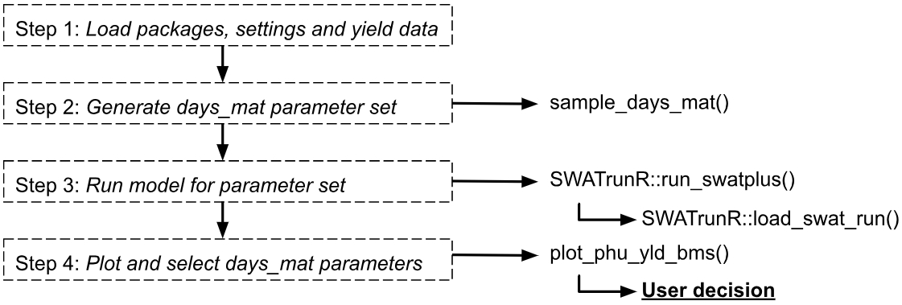

# Introduction to Soft Calibration of Crops

The **SWATtunR** package provides a structured approach to soft calibration of crop parameters, aiming to align SWAT+ simulations with observed crop yields. This process is detailed in a template script, initially developed under the EU project [OPTAIN](https://www.optain.eu/) and documented in its [deliverables](https://zenodo.org/records/11233622), where its application across various European case studies is explored. The calibration is a two-stage routine designed to be tailored to individual SWAT projects. First, it adjusts the days to maturity for each crop to match its characteristics and management schedules. Subsequently, additional crop parameters can be fine-tuned if necessary to achieve accurate yield simulations, ensuring a robust and reproducible calibration process.

# Soft Calibration Workflow ('days_mat')

In your created soft calibration directory with the `initialize_softcal()` function, the `workflow/01_crops_calibration.R` script file is included. This script serves as a starting point, providing a customizable template to guide users through the crop soft calibration process effectively.

Following the steps outlined in this page comes from the script, users can adapt the calibration routine to their specific SWAT+ model setup and observed data. The script is designed to be flexible, allowing for modifications based on the unique characteristics of the crops being modeled and the management practices in place.

```{r sc_crops, echo=FALSE, out.width='80%', fig.align='center'}

```


## 1. Load packages, settings and yield data {#scc_step1}

The **SWATtunR** package is essential for soft calibration, as it provides the necessary functions for the calibration process. Additional packages are required for data manipulation, visualization, SWAT+ model runs, etc. Example here is provided using SWAT+ model setup provided by  **SWATdata** package, but the workflow can be applied to any SWAT+ project. 

```{r sc_st1, message = FALSE, warning = FALSE}
## Required libraries to run workflow
library(SWATtunR)
library(SWATrunR)
library(tidyverse)
library(tibble)
library(purrr)

# Parameter definition ----------------------------------------------------
# Path to the SWAT+ project folder.
model_path <- 'test/swatplus_rev60_demo'

# Set the number of cores for parallel model execution
n_cores <- Inf # Inf uses all cores. Set lower value if preferred.

# Set the number parameter combinations for the LHS sampling of crop parameters
n_combinations <- 10

# Path to the observed crop yields.
# This file must be updated with case study specific records!
yield_obs_path <- './observation/crop_yields.csv'

# Load and prepare data ---------------------------------------------------
# Load the yield observations
yield_obs  <- read.csv(yield_obs_path)

# Define the crops which should be used in the calibration.
# Default is all crops which are defined in yield_obs.
# Please define manually if only selected crops should be considered.
crop_names <- yield_obs$plant_name

# Optional reset of plants.plt --------------------------------------------
# In the case the crop calibration workflow should be redone after the last step
# of this script was already executed and the plants.plt was overwritten the
# plants.plt should be reset to its initial condition. To perform the reset set
# reset <- TRUE
reset <- FALSE
if(reset) {
  file.copy('./backup/plants.plt',
            paste0(model_path, '/plants.plt'),
            overwrite = TRUE)
} else if (!file.exists('./backup/plants.plt')){
  file.copy(paste0(model_path, '/plants.plt'),
            './backup/plants.plt',
            overwrite = FALSE)
}
```


## Generate days_mat parameter set {#scc_step2}

The days to maturity (`days_mat`) determine how quickly or slowly a crop develops in a SWAT+ model, as it is converted into the heat units required for a crop to fully mature. To ensure the crop behaves as intended, the days_mat value must align with the defined management operations schedule. To identify suitable days_mat values for selected crops, a parameter set is created where the `days_mat` value for each crop is varied within a range (change_min, change_max) using fixed intervals (change_step).

```{r sc_st2, message = FALSE, warning = FALSE}
par_dmat <- sample_days_mat(crop_names)
```


## Run model for parameter set
## Plot and select days_mat parameters
## Add additional parameters
## Run model for additional parameter set
## Plot and select values for parameters
## Run final simulation, evaluate results)
## Write 'plants.plt'
