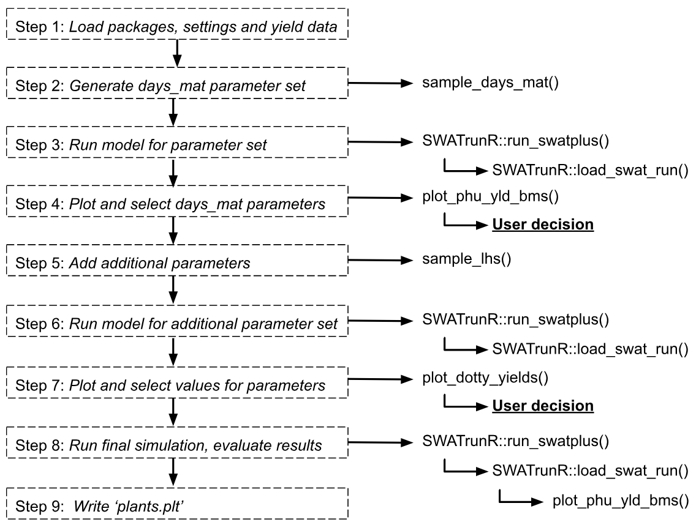
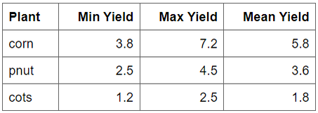
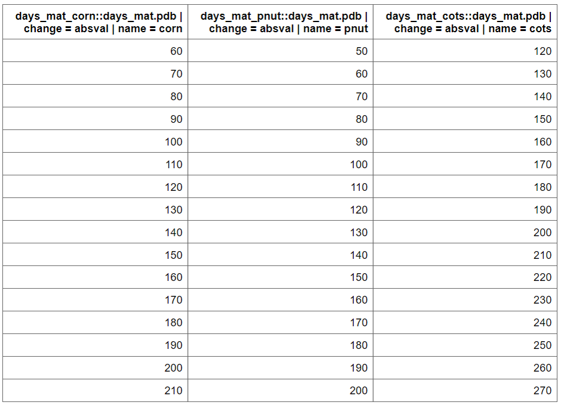
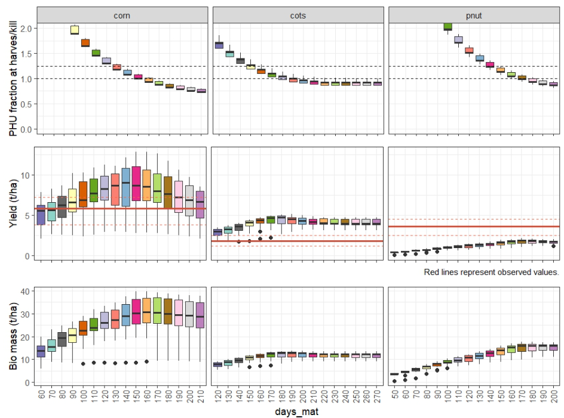

# Introduction

The **SWATtunR** package provides a structured approach to soft calibration of crop parameters, aiming to align SWAT+ simulations with observed crop yields. This process is detailed in a template script, initially developed under the EU project [OPTAIN](https://www.optain.eu/) and documented in its [deliverables](https://zenodo.org/records/11233622), where its application across various European case studies is explored. The calibration is a three-stage routine tailored to individual SWAT projects. First, it adjusts the days to maturity for each crop to achieve Plant Heat Unit (PHU) fractions at harvest between 1.0 and 1.2. Second, up to four additional crop parameters can be fine-tuned, if necessary, to align simulated yields with observed statistics. The final step is to use the `esco` and `epco` parameters to match the simulated water yield ratio to the observed one.

# Workflow

In your created soft calibration directory with the `initialize_softcal()` function, the `workflow/01_crop_phu.R` script file is included. This script serves as a starting point, providing a customizable template to guide users through the days to maturity (`days_mat`) parameter calibration process effectively.

Following the steps outlined in this page comes from the script, users can adapt the calibration routine to their specific SWAT+ model setup and observed data. The script is designed to be flexible, allowing for modifications based on the unique characteristics of the crops being modeled and the management practices in place.

```{r sc_crops, echo=FALSE, out.width='95%', fig.align='center'}

```


# 1. Load packages, settings and yield data {#scc_step1}

The **SWATtunR** package is essential for soft calibration, as it provides the necessary functions for the calibration process. Additional packages are required for data manipulation, visualization, SWAT+ model runs, etc. Example here is provided using SWAT+ model setup provided by  **SWATtunR** package, but the workflow can be applied to any SWAT+ project. 

```{r sc_st1, message = FALSE, warning = FALSE, eval = FALSE}
## Required libraries to run workflow
library(SWATtunR)
library(SWATrunR)
library(tidyverse)
library(tibble)
library(purrr)

# Parameter definition ----------------------------------------------------
# Path to the SWAT+ project folder.
model_path <- 'test/swatplus_rev60_demo'

# Set the number of cores for parallel model execution
n_cores <- Inf # Inf uses all cores. Set lower value if preferred.

# Set the number parameter combinations for the LHS sampling of crop parameters
n_combinations <- 10

# Path to the observed crop yields.
# This file must be updated with case study specific records!
yield_obs_path <- './observation/crop.csv'

# Load and prepare data ---------------------------------------------------
# Load the yield observations
yield_obs  <- read.csv(yield_obs_path)

# Define the crops which should be used in the calibration.
# Default is all crops which are defined in yield_obs.
# Please define manually if only selected crops should be considered.
crop_names <- yield_obs$plant_name

# Optional reset of plants.plt --------------------------------------------
# In the case the crop calibration workflow should be redone after the last step
# of this script was already executed and the plants.plt was overwritten the
# plants.plt should be reset to its initial condition. To perform the reset set
# reset <- TRUE
reset <- FALSE
if(reset) {
  file.copy('./backup/plants.plt',
            paste0(model_path, '/plants.plt'),
            overwrite = TRUE)
} else if (!file.exists('./backup/plants.plt')){
  file.copy(paste0(model_path, '/plants.plt'),
            './backup/plants.plt',
            overwrite = FALSE)
}
```

In your case the crop yield information is quite simple. 

```{r sc_st11, echo=FALSE, out.width='60%', fig.align='center'}

```

# 2. Generate days_mat parameter set {#scc_step2}

The days to maturity (`days_mat`) determine how quickly or slowly a crop develops in a SWAT+ model, as it is converted into the heat units required for a crop to fully mature. To ensure the crop behaves as intended, the days_mat value must align with the defined management operations schedule. To identify suitable days_mat values for selected crops, a parameter set is created where the `days_mat` value with `sample_day_mat()` function for each crop is varied within a range (change_min, change_max) using fixed intervals (change_step).

```{r sc_st2, message = FALSE, warning = FALSE, eval = FALSE}
par_dmat <- sample_days_mat(crop_names)
```

`par_dmat` is a data frame containing the `days_mat` values for each crop, which will be used in the calibration process. `plants.plt` file is used to get initial values  The function `sample_days_mat()` generates a range of values based on the defined parameters.


```{r sc_st21, echo=FALSE, out.width='90%', fig.align='center'}

```

# 3. Run model for parameter set

The next step is to run the SWAT+ model with the generated `days_mat` parameter set. The `run_swatplus` function from **SWATrunR** package executes the model simulations for each combination of parameters in `par_dmat`. The results are stored in `simulation` folder, which can be used for further analysis. The folder will include a timestamp to distinguish each run. When the process is repeated, the analysis will automatically use the most recent set of simulation results.


```{r sc_st3, message = FALSE, warning = FALSE, eval = FALSE}
# Run the SWAT+ model with the generated days_mat parameter set
run_swatplus(project_path = model_path,
             output = list(yld = define_output(file = 'mgtout',
                                               variable = 'yld',
                                               label = crop_names),
                           bms = define_output(file = 'mgtout',
                                               variable = 'bioms',
                                               label = crop_names),
                           phu = define_output(file = 'mgtout',
                                               variable = 'phu',
                                               label = crop_names)
             ),
             parameter        = par_dmat,
             start_date       = NULL, # Change if necessary.
             end_date         = NULL, # Change if necessary.
             years_skip       = NULL, # Change if necessary.
             n_thread         = n_cores,
             save_path        = './simulation',
             save_file        = add_timestamp('sim_dmat'),
             return_output    = FALSE,
             time_out         = 3600 # seconds, change if run-time differs
             )


```

# 4. Plot and select days_mat parameters

After the running the model it is important to load the results and visualize the crop yields, PHU fractions at harvest, biomass to assess the performance of the model with the different `days_mat` values. The `load_swat_run` function from the **SWATrunR** package is used to load the most recent simulation results from the `simulation` folder. The `plot_phu_yld_bms()` function is then used to visualize the crop yields for each crop and `days_mat` value. 

```{r sc_st4, message = FALSE, warning = FALSE, eval = FALSE}
# Load the most recent dmat simulation results
dmat_sims <- list.files('./simulation/', pattern = '[0-9]{12}_sim_dmat')
dmat_path <- paste0('./simulation/', dmat_sims[length(dmat_sims)])
ylds_phu_dmat <- load_swat_run(dmat_path, add_date = FALSE)

# Plot PHU, crop yields and biomass over adjusted days to maturity values.
plot_phu_yld_bms(ylds_phu_dmat, yield_obs)
```

```{r sc_st41, echo=FALSE, out.width='95%', fig.align='center'}

```

From this figure you can select the `days_mat` values for each crop that fall within PHU correct interval 1 - 1.2 and the best match the observed yields. The selected values are saved with this code snippet as `dmat_sel` and will be used in the next step. 

```{r sc_st42, message = FALSE, warning = FALSE, eval = FALSE}
# Set days to maturity values for all selected crops based on the figure above.
dmat_sel <- tibble(
  plant_name                       = c('corn', 'cots', 'pnut'),
  'days_mat.pdb | change = absval' = c(140, 160, 160))

# Check if user defined days to maturity values for all crops.
stopifnot(all(crop_names %in% dmat_sel$plant_name))
# Update names of dmat_sel to be used as SWATrunR parameters
dmat_sel <- prepare_plant_parameter(dmat_sel)
```

# Next steps

If you think the PHU fractions and yields are acceptable, you can proceed to updating `plants.plt`. For more details, see [steps 5](../articles/sc-yield.html#sccy_step5) and [step 6](../articles/sc-yield.html#sccy_step6) of the next workflow [page](../articles/sc-yield.html).

*If you think crop yields are not acceptable*, you can proceed to the next step of adjusting additional crop parameters to further improve the yield simulation. This is done in the `workflow/02_crop_yield.R` script file, with guidance provided on the next page [here](../articles/sc-yield.html).

*If you think crop yields are not acceptable*, you can proceed to the next step of water yield ratio soft calibration [here](../articles/sc-wy.html). Crop and water yield calibration are interconnected. Changes in plant parameters can affect evapotranspiration and water yield, while parameters like `epco` may influence crop yields. Therefore, track both yields before final parameter selection for soft calibration and hard calibration.

