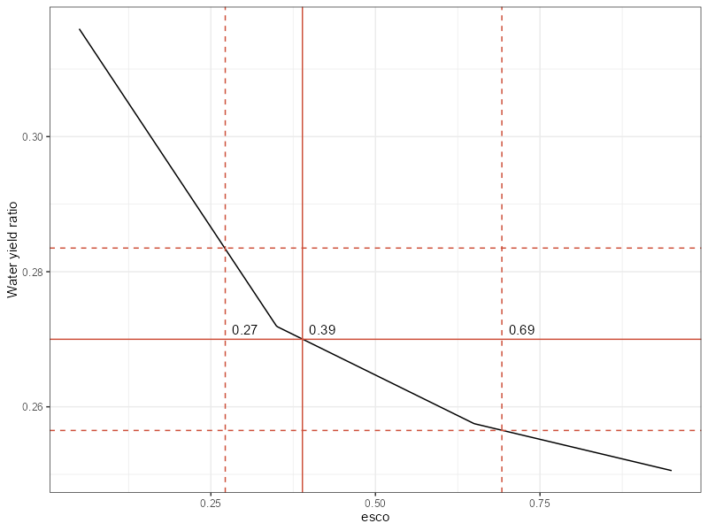
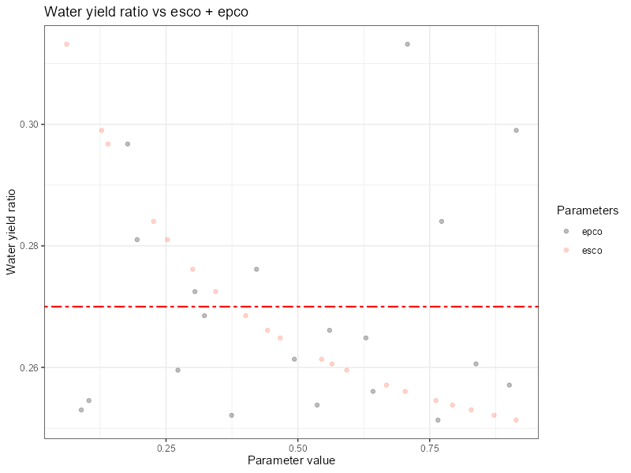

## 1. Loading required packages {#scw_step1}

If those have not yet been loaded with [crop yields](../articles/sc-cy.html) soft calibration, please load following libraries. 

```{r libraries, message = FALSE, warning = FALSE}
## Required libraries to run workflow
library(SWATtunR)
library(SWATrunR)
library(tidyverse)
library(tibble)
library(purrr)
```

## 2. Defining settings {#scw_step2}

This step requires defining the SWAT+ model path the observed water yield to precipitation ratio. 

```{r settings_wy, message = FALSE, warning = FALSE}
# Path to the SWAT+ model
model_path <- '../test/my_dearest_model'

# Set the path to save results of the soft calibration
sc_res <- '../test/simulations'

# Observed water yield to precipitation ratio
obs_wy_ratio <- 0.27

# Set the number of cores available for calculations.  
# Number of cores for 12 runs use 3, 4, 6, or 12 cores (if available)
cores <- 3

## Set the start and end date for the simulations and warm-up period
start_date <- '2015-01-01'
end_date <- '2020-12-31'
years_skip <- 2
```

## 3. Defining `esco` parameter range and running model {#scw_step3}

The soil evaporation compensation factor (`esco`) is an important coefficient in modeling soil moisture dynamics. It allows users to adjust the depth distribution used to satisfy soil evaporative demand, accounting for factors such as capillary action, crusting, and cracks. By increasing the `esco` value, the model can draw more of the evaporative demand from deeper soil layers. This means that the model has reduced amount of water available for water yield. `esco` values range from *0.01* to *1*. 

```{r run_esco, message = FALSE, warning = FALSE, eval = FALSE}
# The esco parameter range is sampled.
esco <- tibble('esco.hru | change = absval' = seq(0.05,0.95, length.out = max(cores, 4)))

sim_esco <- run_swatplus(project_path = model_path,
                         output = list(precip  =  define_output('basin_wb_day', 
                                                                'precip', 
                                                                1),
                                       surq_cha = define_output(file = 'basin_wb_day',
                                                                variable = 'surq_cha',
                                                                unit = 1),
                                       surq_res = define_output(file = 'basin_wb_day',
                                                                variable = 'surq_res',
                                                                unit = 1),
                                       latq_cha = define_output(file = 'basin_wb_day',
                                                                variable = 'latq_cha',
                                                                unit = 1),
                                       latq_res = define_output(file = 'basin_wb_day',
                                                                variable = 'latq_res',
                                                                unit = 1),
                                       qtile =    define_output(file = 'basin_wb_day',
                                                                variable = 'qtile',
                                                                unit = 1),
                                       flo =      define_output(file = 'basin_aqu_day',
                                                                variable = 'flo',
                                                                unit = 1)
                         ),
                         parameter = esco,
                         start_date = start_date,
                         end_date = end_date,
                         years_skip = years_skip,
                         n_thread = cores)
## Save the results to the file
saveRDS(sim_esco, paste0(sc_res, "/sim_esco.rds"))
```
## 4. Extracting and plotting water yield ratio vs `esco` parameter values {#scw_step4}

The water yield ratio is calculated for each simulation. The range of `esco` values that produce water yield ratios within a specified range of the observed water yield ratio is identified using the [plot_esco_range](../reference/plot_esco_range.html) function. 

```{r wy_ratio_f, message = FALSE,  warning = FALSE, eval = FALSE}
plot_esco_range(sim_esco, obs_wy_ratio)
```

```{r wy_ratio_t,  echo=FALSE, out.width='100%', fig.align = 'center'}
## Read the saved simulation results, plot to object, save to file and display figure
# sim_esco <- readRDS(paste0(sc_res, "/sim_esco.rds"))
# p <- plot_esco_range(sim_esco, obs_wy_ratio)
# ggsave(p, file='figs/sim_esco.png', width=800, height=600, units = 'px', dpi = 100)

```

## 5. (Optional) If only esco is not enough, use esco, epco parameters for calibration together {#scw_step5}

In certain situations `esco` parameter might not be enough to reach observed water yield ratio. Addition of the plant uptake compensation factor (`epco`) might help in such cases. This parameter determines how water uptake is distributed across soil layers to meet plant transpiration needs. If the upper soil layers lack sufficient water, the model can draw more water from deeper layers, a process governed by the `epco` value. When `epco` is close to *1.0*, there is greater flexibility, allowing significant compensation from lower soil layers. Conversely, when `epco` is near *0.0*, the model restricts water uptake primarily to the original depth distribution, limiting compensation from deeper layers.

```{r run_esco_epco, message = FALSE, warning = FALSE, eval = FALSE}
# The esco and epco parameter range is defined .
par_bnd <- tibble('esco.hru | change = absval' = c(0.05, 0.95),
                  'epco.hru | change = absval' = c(0.05, 0.95))

# And sampled with lhs 
esco_epco <- sample_lhs(par_bnd, 20) 

##Run simulations for defined parameter sets
sim_esco_epco <- run_swatplus(project_path = model_path,
                         output = list(precip  =  define_output('basin_wb_day', 
                                                                'precip', 
                                                                1),
                                       surq_cha = define_output(file = 'basin_wb_day',
                                                                variable = 'surq_cha',
                                                                unit = 1),
                                       surq_res = define_output(file = 'basin_wb_day',
                                                                variable = 'surq_res',
                                                                unit = 1),
                                       latq_cha = define_output(file = 'basin_wb_day',
                                                                variable = 'latq_cha',
                                                                unit = 1),
                                       latq_res = define_output(file = 'basin_wb_day',
                                                                variable = 'latq_res',
                                                                unit = 1),
                                       qtile =    define_output(file = 'basin_wb_day',
                                                                variable = 'qtile',
                                                                unit = 1),
                                       flo =      define_output(file = 'basin_aqu_day',
                                                                variable = 'flo',
                                                                unit = 1)
                         ),
                         parameter = esco_epco,
                         start_date = start_date,
                         end_date = end_date,
                         years_skip = years_skip,
                         n_thread = cores)

## Save the results to the file
saveRDS(sim_esco_epco, paste0(sc_res, "/sim_esco_epco.rds"))

## Plot the results
plot_dotty(as.data.frame(SWATtunR:::calculate_wyr(sim_esco_epco)), 
           list(sim_esco_epco$parameter$values$epco, 
                sim_esco_epco$parameter$values$esco), 
           list("epco", "esco"), 
           y_inter = obs_wy_ratio)+
  labs(x = "Water yield ratio", y = "Parameter value",  color = "Parameters", title = "Water yield ratio vs esco + epco")+
  theme(strip.background = element_blank(), strip.text = element_blank())
```

```{r wy_ratio_esco_epco_t,  echo=FALSE, out.width='100%', fig.align = 'center'}
## Read the saved simulation results, plot to object, save to file and display figure
# sim_esco_epco <- readRDS(paste0(sc_res, "/sim_esco_epco.rds"))
# p <- plot_dotty(as.data.frame(SWATtunR:::calculate_wyr(sim_esco_epco)),
#            list(sim_esco_epco$parameter$values$epco, 
#                 sim_esco_epco$parameter$values$esco), 
#            list("epco", "esco"), 
#            y_inter = obs_wy_ratio)+
#   labs(x = "Water yield ratio", y = "Parameter value",  color = "Parameters", title = "Water yield ratio vs esco + epco")+
#   theme(strip.background = element_blank(), strip.text = element_blank())
# ggsave(p, file='figs/sim_esco_epco.png', width=800, height=600, units = 'px', dpi = 100)

```

## 6. Updating parameter values in the `'hydrology.hyd'` file with selected values {#scw_step6}

After determining which model parameter values allow the simulated water yield ratio to match the observed values, these parameters need to be updated in the `'hydrology.hyd'` file. Following code snippet backs up existing file and updates values in it. 

```{r update_p, message = FALSE, warning = FALSE, eval = FALSE}

## Initialize unmodified backup version of hydrology.hyd
if(!file.exists(paste0(model_path, '/hydrology.hyd.bkp0'))) {
  copy_file_version(model_path, 'hydrology.hyd', file_version = 0)
}

# Read the hydrology.hyd input file
hydrology_hyd <- read_tbl(paste0(model_path, '/hydrology.hyd.bkp0'))

hydrology_hyd$esco <- 0.39
## If needed update epco as well
## hydrology_hyd$epco <- some value

## Update hydrology.hyd file
write_tbl(hydrology_hyd, paste0(model_path, '/hydrology.hyd'), c('%-16s', rep('%12.5f', 14)))

```

## 7. Final recheck for yield results

Updating parameters in the `'hydrology.hyd'` file might impact crop yield simulation. To ensure that the water yield soft calibration has not adversely affected the crop yield soft calibration, it is important to recheck it at the end. If the results match the observed yields, the soft calibration is complete, and you can celebrate. Otherwise, you should consider revisiting the [crop yield soft calibration](../articles/sc-cy.html) steps.

```{r recheck, message = FALSE, warning = FALSE, eval = FALSE}
## Rerun model for crop yields results
phu_yld_recheck <- run_swatplus(project_path = model_path,
                          output = list(yld = define_output(file = 'mgtout',
                                                            variable = 'yld',
                                                            unit = crops),
                                        bms = define_output(file = 'mgtout',
                                                            variable = 'bioms',
                                                            unit = crops),
                                        phu = define_output(file = 'mgtout',
                                                            variable = 'phu',
                                                            unit = crops)),
                          start_date = start_date,
                          end_date = end_date,
                          years_skip = years_skip)
## Save the results to the file
saveRDS(phu_yld_recheck, paste0(sc_res, "/phu_yld_recheck.rds"))

## Plot yields 
plot_phu_yld_bms(phu_yld_recheck, 0, yield_mean, yield_min, yield_max)
```

