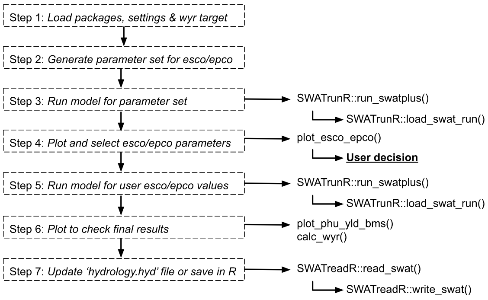
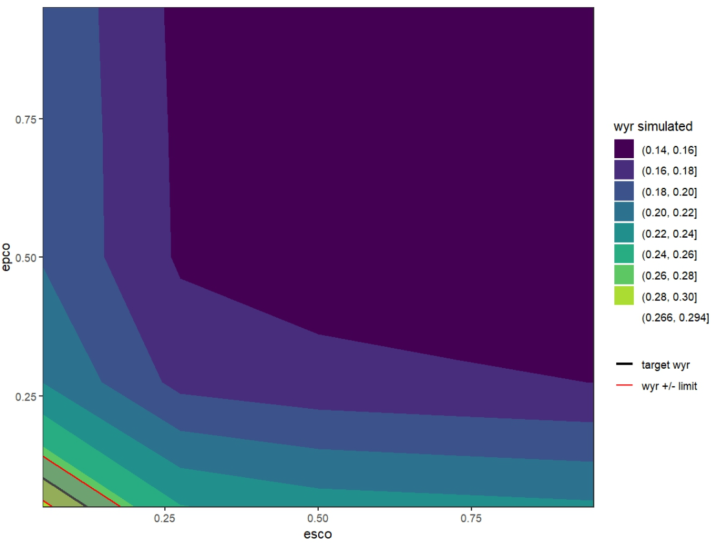
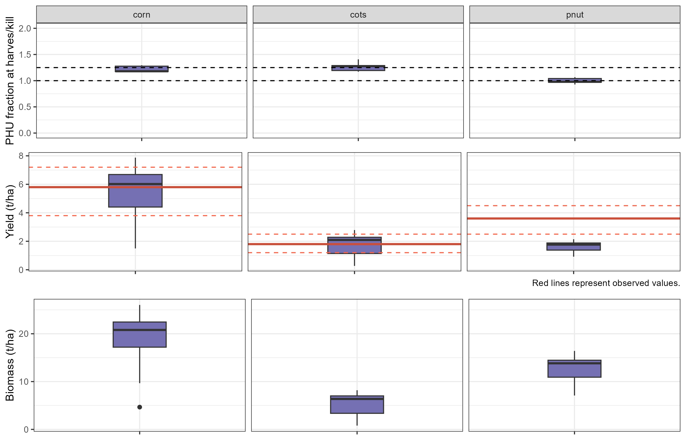

# Introduction

The **SWATtunR** package supports a flexible and systematic approach to soft calibration of hydrological parameters in SWAT+ for water yield calibration. This template script—intended to be adapted for each specific SWAT project—guides users through the calibration.

# Workflow

The calibration process is structured into two main alternatives:

1. **Alternative A**: Calibrate the `esco` parameter to achieve a target water yield ratio for the modeled catchment. `esco` (soil evaporation compensation factor) allows users to adjust the depth distribution used to meet soil evaporative demand, accounting for effects such as capillary action, crusting, and cracks. The default value is 0.5. This parameter is essential for accurately simulating the water balance in SWAT+ models, especially in regions where soil evaporation significantly influences the hydrological cycle.

2. **Alternative B**: Jointly calibrate the `esco` and `epco` parameters. `epco` (plant uptake compensation factor) controls the extent to which deeper soil layers can compensate for water shortages in upper layers. When `epco` is close to 1.0, plants can draw more water from deeper layers; when near 0.0, uptake is restricted to the original root depth distribution, allowing minimal compensation.

If this alternative is chosen, `epco` should be kept as close as possible to its default value of 0, as significant changes can strongly affect crop yield simulations. If such changes occur, the crop yield soft calibration [step](../articles/sc-crops.html) should be revisited.

The following workflow script is generated by the soft calibration function `initialize_softcal()`. It is located in `workflow/02_wateryield.R`. This script serves as a customizable template to guide users through the water yield soft calibration process effectively.

An overview of all workflow steps is presented in the figure below. This page provides a detailed description of each step, including the necessary code snippets and explanations.

```{r sc_wy, echo=FALSE, out.width='95%', fig.align='center'}

```

# 1. Load packages, settings & WYR target {#scwy_step1}

The **SWATtunR** package is essential for soft calibration, as it provides the necessary functions for the calibration process. Additional packages are required for data manipulation, visualization, SWAT+ model runs, etc.

In this example, we present the **Alternative B** workflow for water yield ratio soft calibration, as it represents the slightly more complex option. Users can switch to **Alternative A** by setting the `alternative` variable to `'A'`. The model path should be updated to point to the user's specific SWAT+ project folder.

```{r sc_wy1, message = FALSE, warning = FALSE, eval = FALSE}
# Load required R packages ------------------------------------------------
library(SWATtunR)
library(SWATrunR)
library(tibble)

# Parameter definition ----------------------------------------------------
# Decide for calibration alternative 'A' (only esco) or 'B' (esco and epco).
alternative <- 'B'

# Path to the SWAT+ project folder.
model_path <- 'test/swatplus_rev60_demo'

# Set the number of cores for parallel model execution
n_cores <- Inf # Inf uses all cores. Set lower value if preferred.

# Set the number of steps in which the parameters esco/epco should be sampled
# A low number of e.g. 5 to 10 is absolutely sufficient.
n_step <- 5

# Set the target water yield ratio for the catchment (calculated from precipitation and flow data)
wyr_target <- 0.3

# Load and prepare data ---------------------------------------------------
# Load the yield observations
yield_obs_path <- './observation/crop_yields.csv'
yield_obs  <- read.csv(yield_obs_path)

# Define the crops which should be used in the calibration.
# Default is all crops which are defined in yield_obs.
# Please define manually if only selected crops should be considered.
crop_names <- yield_obs$plant_name

# Optional reset of hydrology.hyd -----------------------------------------
# In the case the water yield ratio calibration workflow should be redone after
# the last step of this script was already executed and the hydrology.hyd was
# overwritten the hydrology.hyd should be reset to its initial condition. To
# perform the reset set reset <- TRUE
reset <- FALSE
if(reset & file.exists('./backup/hydrology.hyd')) {
  file.copy('./backup/hydrology.hyd',
            paste0(model_path, '/hydrology.hyd'),
            overwrite = TRUE)
}

```

# 2. Generate parameter set for esco/epco {#scwy_step2}

In this step, we generate a parameter set for the `esco` and `epco` parameters. If `n_step` is set to 5, then 5 × 5 = 25 parameter combinations will be generated. The parameters are sampled at equal intervals between 0.05 and 0.95. Other intervals can be used as well.

```{r sc_wy2, message = FALSE, warning = FALSE, eval = FALSE}
# Alternative A: Calibrate esco -------------------------------------------
if(alternative == 'A') {
  # Sample the paramter esco with the defined number of steps.
  par_esco_epco <- tibble('esco.hru | change = absval' =
                            seq(0.05,0.95, length.out = n_step))

# Alternative B: Calibrate esco and epco ----------------------------------
} else if (alternative == 'B') {
  # Define the esco and epco parameter ranges.
  par_bnd <- tibble('esco.hru | change = absval' = seq(0.05, 0.95, length.out = n_step),
                    'epco.hru | change = absval' = seq(0.05, 0.95, length.out = n_step))

  # Sample the esco epco combinations with LHS sampling.
  par_esco_epco <- expand.grid(par_bnd)
}
```

# 3. Run model for parameter set {#scwy_step3}

In this step `run_swatplus` function from **SWATrunR** package executes the model simulations for each combination of prepared parameters. All simulation results are saved in the `./simulation` folder. Each set of results is time-stamped, so if the process is repeated, the most recent simulations are always used in the analysis.
```{r sc_wy3, message = FALSE, warning = FALSE, eval = FALSE}  
# Run the SWAT+ model for each parameter combination
run_swatplus(project_path = model_path,
             output = list(precip  =  define_output(file = 'basin_wb_aa',
                                                    variable = 'precip',
                                                    unit = 1),
                           surq_cha = define_output(file = 'basin_wb_aa',
                                                    variable = 'surq_cha',
                                                    unit = 1),
                           surq_res = define_output(file = 'basin_wb_aa',
                                                    variable = 'surq_res',
                                                    unit = 1),
                           latq_cha = define_output(file = 'basin_wb_aa',
                                                    variable = 'latq_cha',
                                                    unit = 1),
                           latq_res = define_output(file = 'basin_wb_aa',
                                                    variable = 'latq_res',
                                                    unit = 1),
                           qtile =    define_output(file = 'basin_wb_aa',
                                                    variable = 'qtile',
                                                    unit = 1),
                           flo =      define_output(file = 'basin_aqu_aa',
                                                    variable = 'flo',
                                                    unit = 1)
             ),
             parameter        = par_esco_epco,
             start_date       = NULL, # Change if necessary.
             end_date         = NULL, # Change if necessary.
             add_date         = FALSE,
             years_skip       = NULL, # Change if necessary.
             n_thread         = n_cores,
             save_path        = './simulation',
             save_file        = add_timestamp('sim_wbal'),
             return_output    = FALSE,
             time_out         = 3600 # seconds, change if run-time differs
             )
```

# 4. Plot and select esco/epco parameters {#scwy_step4}

The `load_swat_run` function from the **SWATrunR** package is used to load the most recent simulation results from the `simulation` folder. The `plot_esco_epco()` function is then used to visualize the results.

Based on the simulated water balance components for the different `esco` and `epco` values, a simulated water yield ratio is calculated and plotted against the parameter values. The plot also includes the target water yield ratio to help identify a suitable range or value for `esco` and `epco`.

```{r sc_wy4, message = FALSE, warning = FALSE, eval = FALSE}  
# Load the most recent simulation results of the water balance components.
wbal_sims <- list.files('./simulation/', pattern = '[0-9]{12}_sim_wbal')
wbal_path <- paste0('./simulation/', wbal_sims[length(wbal_sims)])
wbal_sim  <- load_swat_run(wbal_path, add_date = FALSE)

# Plot the water balance components and the water yield ratio
plot_esco_epco(wbal_sim, 0.28, rel_wyr_limit = 0.05)
```

```{r sc_wy41, echo=FALSE, out.width='95%', fig.align='center'}

```

The `esco`/`epco` plot displays recommended parameter values that meet the target water yield ratio. There are two options for defining `esco` and `epco` for further use in the model:

**Option 1: Set fixed values in the `hydrology.hyd` file**
If specific values for `esco` and/or `epco` are selected, they can be written directly into the `hydrology.hyd` file, replacing the initial values. These fixed values can either serve as a starting point for further calibration or be maintained as constant values during later calibration steps.

**Option 2: Use parameter ranges for further calibration**
Alternatively, parameter ranges can be selected based on the plot and used in additional simulations with **SWATrunR**, for example, during more detailed (hard) calibration.

Before choosing one of these options, it is recommended to run an additional simulation using a selected `esco`/`epco` parameter set. This helps evaluate the simulated water yield ratio and crop yields, especially since parameters like `epco` can influence simulated plant growth.

In this example we will use the first option and set fixed values for `esco` and `epco` in the `hydrology.hyd` file. Following values are selected based on the plot above.

```{r sc_w42, message = FALSE, warning = FALSE, eval = FALSE}
# Set fixed values for esco and epco in the hydrology.hyd file. Alternative 'B' is used here.
if (alternative == 'A') {
  par_check <- tibble('esco.hru | change = absval' = 0.5) # Adjust accordingly
} else if (alternative == 'B') {
  par_check <- tibble('esco.hru | change = absval' = 0.02, # Adjust accordingly
                      'epco.hru | change = absval' = 0.12) # Adjust accordingly
}
```

# 5. Run model for user esco/epco values {#scwy_step5}

In this step, the model is run again using the selected `esco` and `epco` values. The results are saved in a new folder.

```{r sc_wy5, message = FALSE, warning = FALSE, eval = FALSE}  
# Rerun model for crop yields results
run_swatplus(project_path = model_path,
             output = list(precip  =  define_output(file = 'basin_wb_aa',
                                                    variable = 'precip',
                                                    unit = 1),
                           surq_cha = define_output(file = 'basin_wb_aa',
                                                    variable = 'surq_cha',
                                                    unit = 1),
                           surq_res = define_output(file = 'basin_wb_aa',
                                                    variable = 'surq_res',
                                                    unit = 1),
                           latq_cha = define_output(file = 'basin_wb_aa',
                                                    variable = 'latq_cha',
                                                    unit = 1),
                           latq_res = define_output(file = 'basin_wb_aa',
                                                    variable = 'latq_res',
                                                    unit = 1),
                           qtile    = define_output(file = 'basin_wb_aa',
                                                    variable = 'qtile',
                                                    unit = 1),
                           flo      = define_output(file = 'basin_aqu_aa',
                                                    variable = 'flo',
                                                    unit = 1),
                           yld      = define_output(file = 'mgtout',
                                                    variable = 'yld',
                                                    label = crop_names),
                           bms      = define_output(file = 'mgtout',
                                                    variable = 'bioms',
                                                    label = crop_names),
                           phu      = define_output(file = 'mgtout',
                                                    variable = 'phu',
                                                    label = crop_names)
             ),
             parameter        = par_check,
             start_date       = NULL, # Change if necessary.
             end_date         = NULL, # Change if necessary.
             # add_date         = FALSE,
             years_skip       = NULL, # Change if necessary.
             n_thread         = n_cores,
             save_path        = './simulation',
             save_file        = add_timestamp('sim_check02'),
             return_output    = FALSE,
             time_out         = 3600 # seconds, change if run-time differs
)

```

# 6. Plot to check final results {#scwy_step6}

Before finalizing the model, it is important to recheck the crop simulation results with the selected `esco` and `epco` values. The `plot_phu_yld_bms()` function can be used again to visualize crop yields and biomass, as well as the Potential Heat Units at the harvest for each crop.

```{r sc_wy6, message = FALSE, warning = FALSE, eval = FALSE}
# Load the most recent simulation results.
check_sims <- list.files('./simulation/', pattern = '[0-9]{12}_sim_check02')
check_path <- paste0('./simulation/', check_sims[length(check_sims)])
check_sim  <- load_swat_run(check_path, add_date = FALSE)

# Plot PHU, crop yields and biomass for final simulation run.
plot_phu_yld_bms(check_sim, yield_obs, 0.3)
```

```{r sc_wy61, echo=FALSE, out.width='95%', fig.align='center'}

```

If everything looks good, the final water yield ratio from the model results should also be checked using the `calc_wyr()` function.

```{r sc_wy62, message = FALSE, warning = FALSE, eval = FALSE}
# Check the simulated water yield ratio with reference to the target wyr.
calc_wyr(check_sim)
```

# 7. Update 'hydrology.hyd' file or save in R {#scwy_step7}

The last step is to save the selected `esco` and `epco` values either in the `hydrology.hyd` file or save them in R for future use. This ensures that the model can be run with these parameters in subsequent simulations.

```{r sc_wy7, message = FALSE, warning = FALSE, eval = FALSE}
# Option 1: Re-writing SWAT+ parameter file hydrology.hyd
# If SWATreadR is not installed please install from:
# devtools::install_github('chrisschuerz/SWATreadR')
library(SWATreadR)

if(!file.exists('./backup/hydrology.hyd')) {
  file.copy(paste0(model_path, '/hydrology.hyd'), './backup/hydrology.hyd')
}

hydrology_hyd <- read_swat(paste0(model_path, '/hydrology.hyd'))

hydrology_hyd$esco <- 0.02 # set value
hydrology_hyd$epco <- 0.12 # set value if epco is considered

write_swat(hydrology_hyd, paste0(model_path, '/hydrology.hyd'), overwrite = TRUE)

# Option 2: Setting parameter values for SWATrunR runs
# To further use esco and epco ranges in e.g. the hard calibration workflow
# add esco and epco ranges in the parameter definition (by default they are
# included). To include their full ranges it may look like this.
# Please adjust the ranges based on the results above.

parameter_boundaries <- tibble(
  'esco.hru | change = absval' = c(0.05, 1),
  'epco.hru | change = absval' = c(0.05, 1),
)
```

# Next steps

If you are satisfied with the water yield ratio and crop yield results, you can proceed to the next step — the hard calibration workflow [here](../articles/hc-par.html).  

However, it may be wise to first examine the model setup using the SWAT+ model setup verification workflow [here](../articles/qa.html), as it can identify potential issues and save considerable time during hard calibration.  

If, on the other hand, the crop yields are not satisfactory in [step 6](#scwy_step6), you should revisit the crop soft calibration workflow [here](../articles/sc-yield.html) before moving on to hard calibration.


