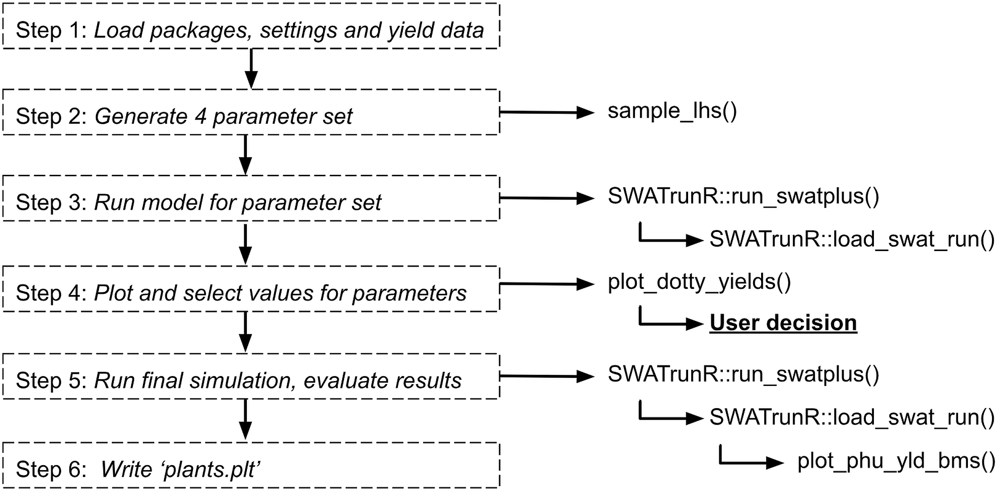
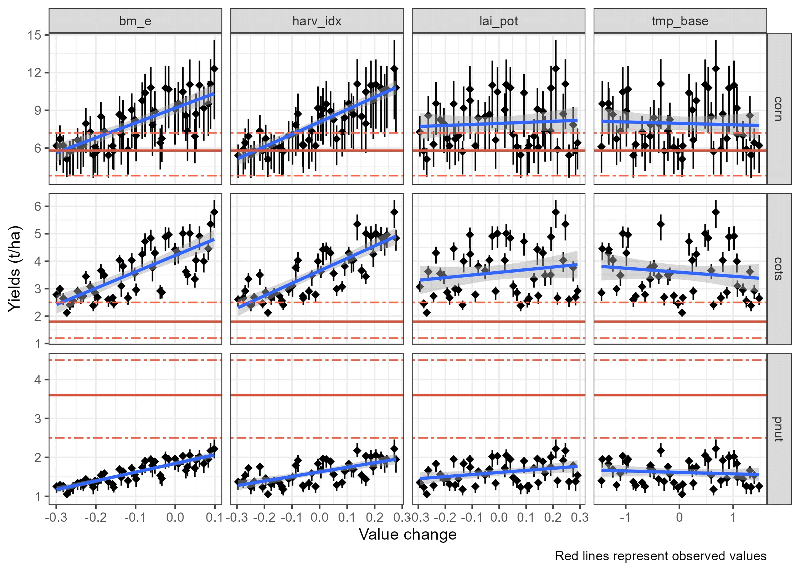
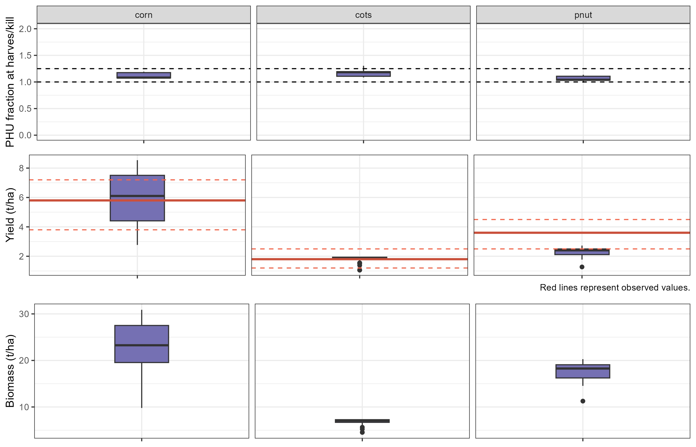

# Workflow

This workflow focuses on adjusting crop parameters to align simulated yields with observed data. The process is similar to the [crop PHU ratio at harvest](../articles/sc-phu.html) calibration, but here we fine-tune four additional parameters: leaf area index, harvest index, base temperature for plant growth, and biomass energy ratio.

```{r sc_crops, echo=FALSE, out.width='95%', fig.align='center'}

```

# 1. Load packages, settings and yield data {#sccy_step1}

This step is the same as in [Crop PHU ratio at harvest](../articles/sc-phu.html#scc_step1).

# 2. Add additional parameters {#sccy_step2}

In addition to `days_mat`, you can also adjust other parameters such as  leaf area index (`lai_pot`), harvest index (`harv_idx`), base temperature for plant growth (`tmp_base`), and biomass energy ratio (`bm_e`). These parameters can be adjusted in a similar way as `days_mat` by creating a parameter set with the `sample_lhs()` function. When making these updates, it is important to ensure that the resulting values remain realistic and biologically meaningful—for example, avoiding negative values or ranges that fall outside plausible agronomic limits.

```{r sc_st5, message = FALSE, warning = FALSE, eval = FALSE}
par_bnd <- tibble('lai_pot.pdb | change = relchg'  = c(-0.3, 0.3),
                  'harv_idx.pdb | change = relchg' = c(-0.3, 0.3),
                  'tmp_base.pdb | change = abschg' = c(-1.5, 1.5),
                  'bm_e.pdb | change = relchg'     = c(-0.3, 0.1))

## The number of samples can be adjusted based on the available computational resources.
## Recommended number of samples is 50-100.
par_crop <- sample_lhs(par_bnd, n_combinations)
# Add updated days to maturity values to parameter set
par_crop <- bind_cols(par_crop, dmat_sel)
```

# 3. Run model for additional parameter set {#sccy_step3}

With all parameters defined, you can now run the SWAT+ model again using the `run_swatplus` function. This will execute the model simulations for each combination of parameters in `par_bnd`, and the results will be stored in the `./simulation` folder. 

```{r sc_st6, message = FALSE, warning = FALSE, eval = FALSE}
# Run the SWAT+ model with the additional parameter set
run_swatplus(project_path = model_path,
             output = list(yld = define_output(file = 'mgtout',
                                               variable = 'yld',
                                               label = crop_names)),
             parameter = par_crop,
             start_date       = NULL, # Change if necessary.
             end_date         = NULL, # Change if necessary.
             years_skip       = NULL, # Change if necessary.
             n_thread         = n_cores,
             save_path        = './simulation',
             save_file        = add_timestamp('sim_yld'),
             return_output    = FALSE,
             time_out         = 3600 # seconds, change if run-time differs
             )
```

# 4. Plot and select values for parameters {#sccy_step4}

After running the model with the additional parameters, you can load and visualize the results to assess the impact of the changes on crop yields. The `plot_dotty_yields()` function is used to plot the crop yields for each combination of parameters, allowing you to select the best-performing parameter set based on yield performance.

```{r sc_st7, message = FALSE, warning = FALSE, eval = FALSE}
# Load the most recent yield simulation results
yld_sims <- list.files('./simulation/', pattern = '[0-9]{12}_sim_yld')
yld_path <- paste0('./simulation/', yld_sims[length(yld_sims)])
yld_sim  <- load_swat_run(yld_path, add_date = FALSE)
# Remove days to maturity parameter columns before plotting.
yld_sim$parameter$values <- yld_sim$parameter$values[, 1:4]
# Check for failed runs
failed_runs(yld_sim)

## Plot dotty figures for the selected crops
plot_dotty_yields(yld_sim, yield_obs)
```

```{r sc_st71, echo=FALSE, out.width='95%', fig.align='center'}

```

Based on this figure user can select the best performing parameter set for each crop. The selected values are saved in `crop_par_sel` and will be used in the final run. 

```{r sc_st72, message = FALSE, warning = FALSE, eval = FALSE}
# Fix the parameter changes you want to apply to the crops
crop_par_sel <- tibble(
  plant_name                       = c("corn", "cots", "pnut"),
  'bm_e.pdb | change = relchg'     = c(  -0.2,   -0.3,   0.1),
  'harv_idx.pdb | change = relchg' = c(  -0.15,  -0.3,   0.3),
  'lai_pot.pdb | change = relchg'  = c(  -0.2,   -0.3,   0.3),
  'tmp_base.pdb | change = abschg' = c(   1.5,    1.5,  -1.0))

# Check if user defined days to maturity values for all crops.
stopifnot(all(crop_names %in% crop_par_sel$plant_name))
# Restructure the set parameter changes to SWATrunR
crop_par_sel <- prepare_plant_parameter(crop_par_sel)
```

# 5. Run final simulation, evaluate results {#sccy_step5}

In the final step, you can run the SWAT+ model with the selected parameters using the `run_swatplus` function. This will execute the model simulations for the final parameter set, and the results will be stored in the `./simulation` folder.

```{r sc_st8, message = FALSE, warning = FALSE, eval = FALSE}
# Run the simulations
run_swatplus(project_path = model_path,
             output = list(yld = define_output(file = 'mgtout',
                                               variable = 'yld',
                                               label = crop_names),
                           bms = define_output(file = 'mgtout',
                                               variable = 'bioms',
                                               label = crop_names),
                           phu = define_output(file = 'mgtout',
                                               variable = 'phu',
                                               label = crop_names)
             ),
             parameter        = par_final,
             start_date       = NULL, # Change if necessary.
             end_date         = NULL, # Change if necessary.
             years_skip       = NULL, # Change if necessary.
             n_thread         = n_cores,
             save_path        = './simulation',
             save_file        = add_timestamp('sim_check01'),
             return_output    = FALSE,
             time_out         = 3600, # seconds, change if run-time differs
             keep_folder      = TRUE
)
```

The final simulation results can be evaluated using the `plot_phu_yld_bms()` function. This plot will help assess whether the changes made to the four parameters have significantly affected crop yield, biomass, or PHU values. Ideally, these outputs should remain consistent (in ranges for PHU and yields), as the main issues related to days-to-maturity were already addressed in the first part of the script.

```{r sc_st81, message = FALSE, warning = FALSE, eval = FALSE}
# Load the most recent check simulation results
check_sims <- list.files('./simulation/', pattern = '[0-9]{12}_sim_check01')
check_path <- paste0('./simulation/', check_sims[length(check_sims)])
check_sim  <- load_swat_run(check_path, add_date = FALSE)

# Plot PHU, crop yields and biomass for final simulation run.
plot_phu_yld_bms(check_sim, yield_obs, 0.3)
```
```{r sc_st82, echo=FALSE, out.width='95%', fig.align='center'}

```
 
# 6. Write 'plants.plt' {#sccy_step6}

If the final simulation results look acceptable, you can save the adjusted parameter table to the project folder by setting `overwrite = TRUE` in the command below. This will replace the original `plants.plt` file. A backup of the original file is available at `./backup/plants.plt` in case you need to restore it.

```{r sc_st9, message = FALSE, warning = FALSE, eval = FALSE}
file.copy(paste0(model_path, '/.model_run/thread_1/plants.plt'), model_path,
          overwrite = TRUE)
unlink(paste0(model_path, '/.model_run'), recursive = TRUE)
```

# Next steps

After calibrating crop yields, you can proceed with the soft calibration of the water yield ratio [here](../articles/sc-wy.html).

